# Scala Visual Guide

## Scala Type Hierarchy

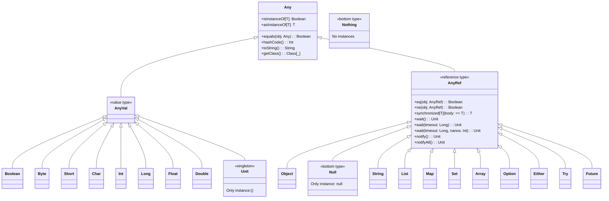

## Object-Oriented Programming

### Class Hierarchy and Inheritance
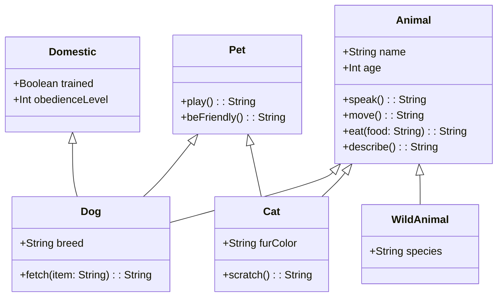

### Case Classes and Pattern Matching
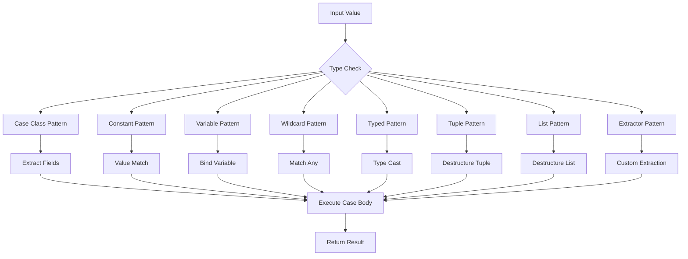

### Companion Objects Pattern
```mermaid
classDiagram
    class Employee {
        +String person
        +String employeeId
        +String department
        +Double salary
        +Address address
        +fullName(): String
        +isAdult(): Boolean
        +monthlySalary(): Double
        +promote(newSalary: Double): Employee
        +move(newAddress: Address): Employee
    }

    class Employee$ {
        +Employee apply(name: String, age: Int, employeeId: String, department: String, salary: Double): Employee
        +createManager(name: String, age: Int, employeeId: String, department: String): Employee
        +createIntern(name: String, age: Int, employeeId: String, department: String): Employee
    }

    Employee ..> Employee$ : companion
```

## Functional Programming

### Function Composition Flow
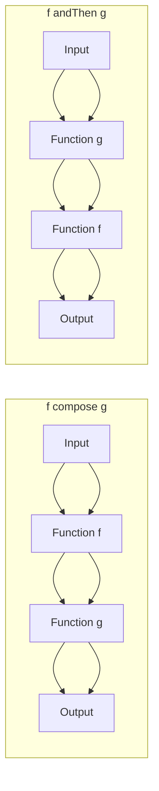

### Collection Operations Pipeline
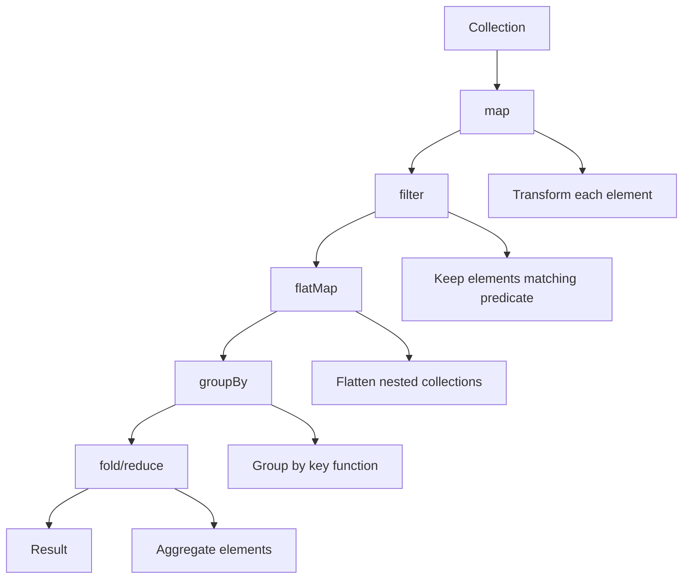

### For Comprehension Desugaring
```mermaid
flowchart TD
    A[For Comprehension] --> B[withFilter]
    B --> C[map/flatMap]
    C --> D[Desugared Code]

    A --> A1[for { x <- xs; y <- ys if condition } yield expression]
    B --> B1[filter/map operations]
    C --> C1[flatMap/map chains]
    D --> D1[xs.withFilter(x => condition).flatMap(x => ys.map(y => expression))]
```

## Advanced Features

### Implicits Resolution Flow
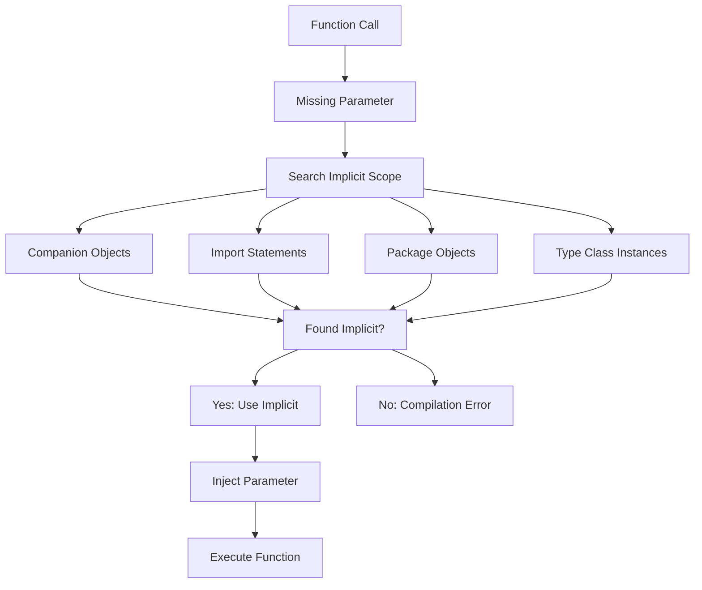

### Type Class Pattern
```mermaid
classDiagram
    class Show~T~ {
        +show(value: T): String
    }

    class Ord~T~ {
        +compare(a: T, b: T): Int
        +lt(a: T, b: T): Boolean
        +gt(a: T, b: T): Boolean
        +lte(a: T, b: T): Boolean
        +gte(a: T, b: T): Boolean
        +equiv(a: T, b: T): Boolean
    }

    class Show {
        +show[T](value: T)(implicit showInstance: Show[T]): String
    }

    class Ord {
        +compare[T](a: T, b: T)(implicit ordInstance: Ord[T]): Int
    }

    Show ..> Show~T~ : uses
    Ord ..> Ord~T~ : uses

    note for Show "Type Class Interface"
    note for Ord "Type Class Interface"
    note for Show$ "Type Class Companion"
    note for Ord$ "Type Class Companion"
```

## Concurrency and Futures

### Future Composition Patterns
```mermaid
flowchart TD
    A[Future[A]] --> B[map]
    A --> C[flatMap]
    A --> D[filter]
    A --> E[recover]
    A --> F[fallbackTo]

    B --> B1[Future[B]]
    C --> C1[Future[B]]
    D --> D1[Future[A]]
    E --> E1[Future[A]]
    F --> F1[Future[A]]

    G[Future[A]] --> H[Future[B]]
    I[Future[B]] --> J[for-comprehension]

    J --> K[Future[C]]
```

### Sequential vs Parallel Execution
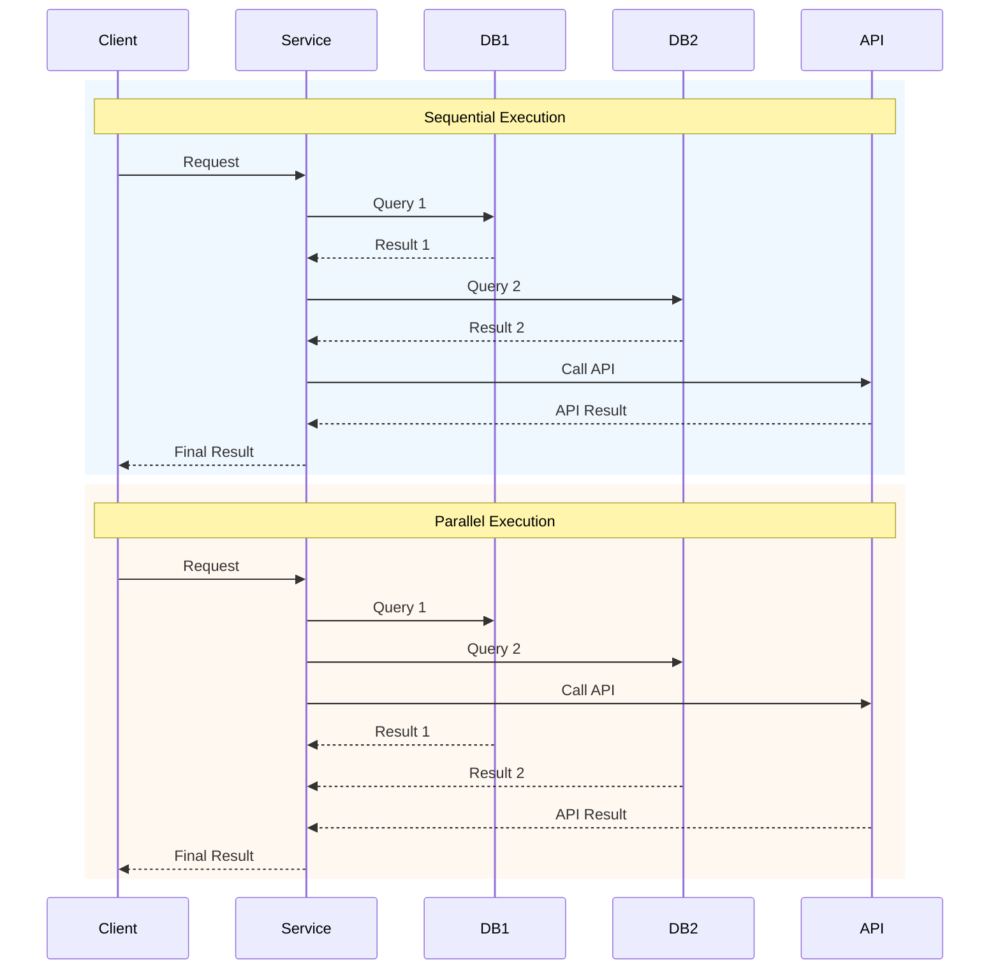

## Akka Actor System

### Actor Hierarchy and Communication
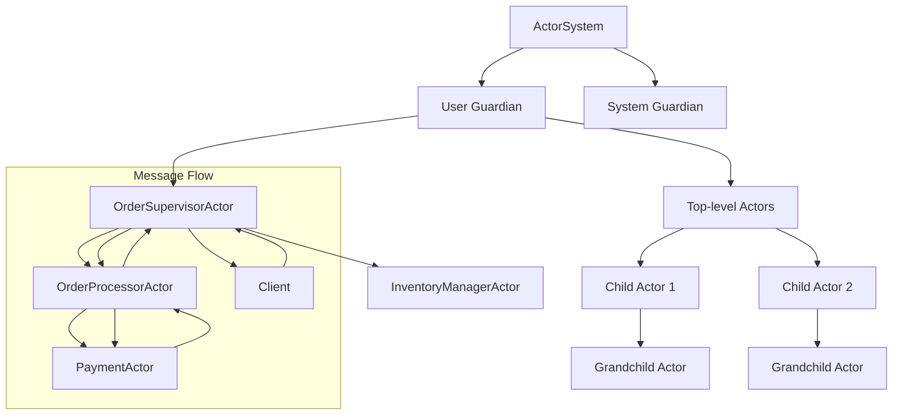

### Actor Lifecycle
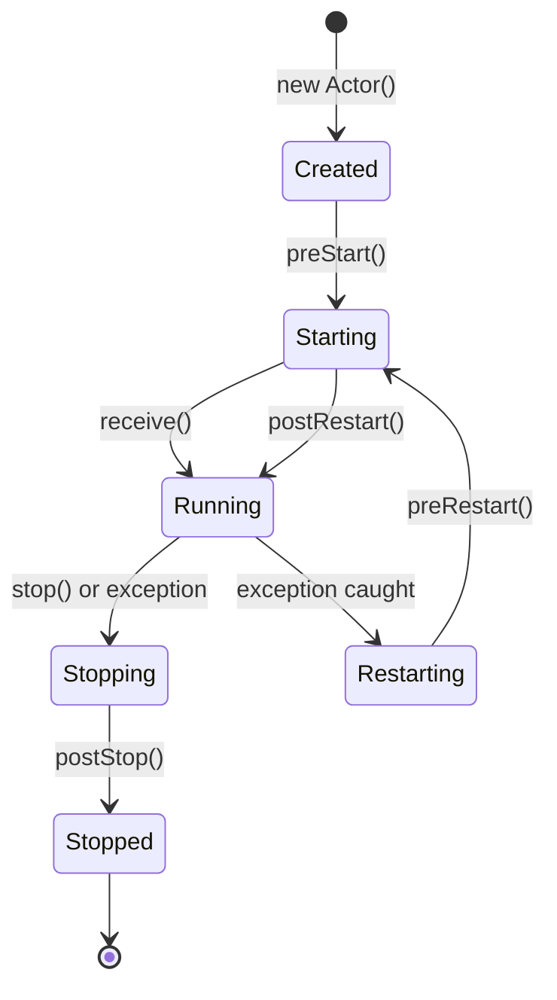

### Message Processing Flow
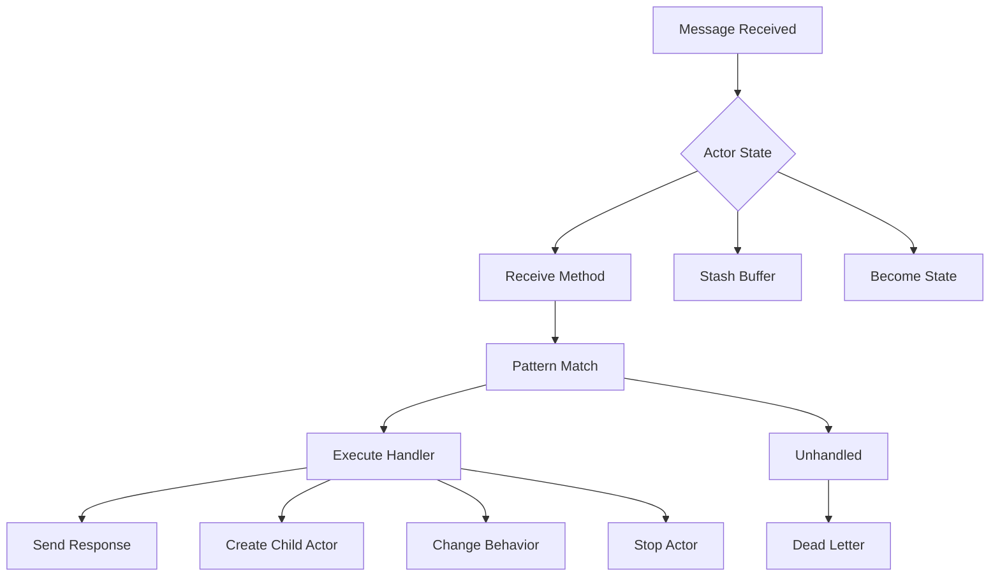

## Play Framework Architecture

### MVC Architecture
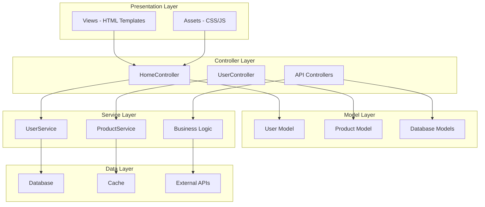

### Request-Response Flow
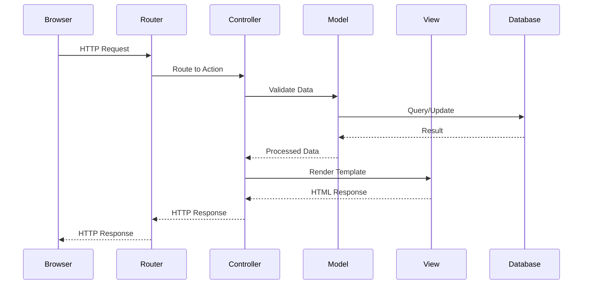

### Form Handling Flow
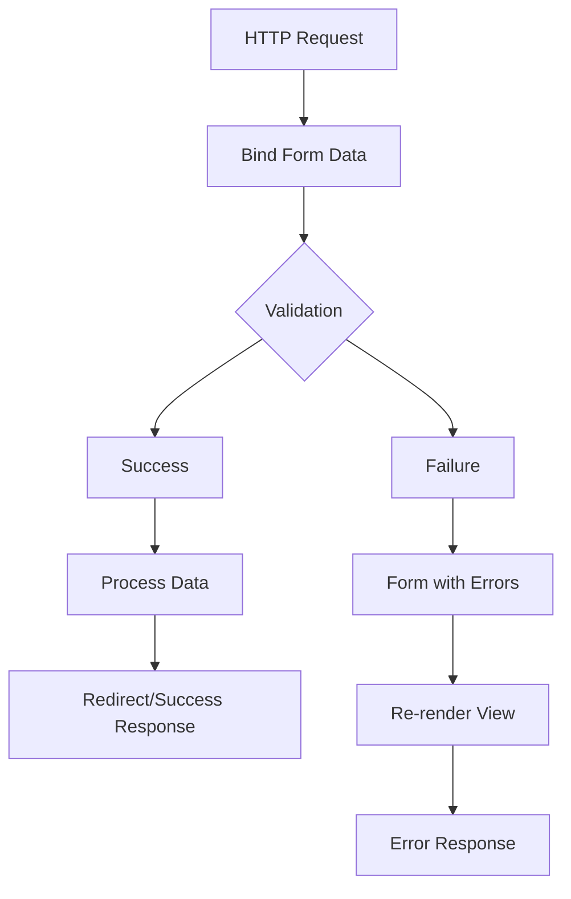

## Apache Spark with Scala

### Spark Application Architecture
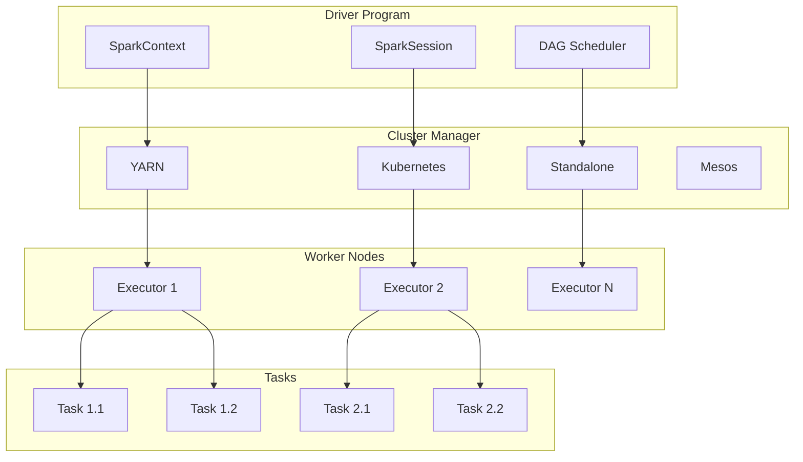

### DataFrame Operations Pipeline
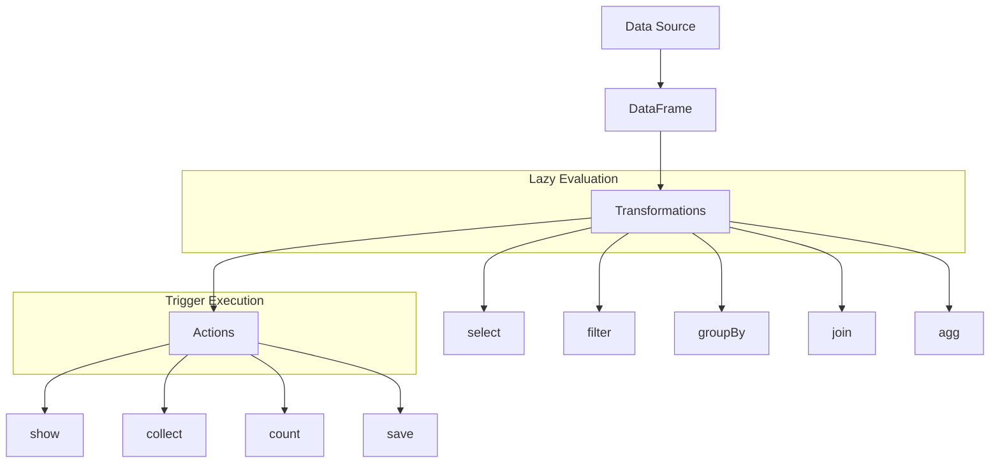

### RDD vs DataFrame vs Dataset
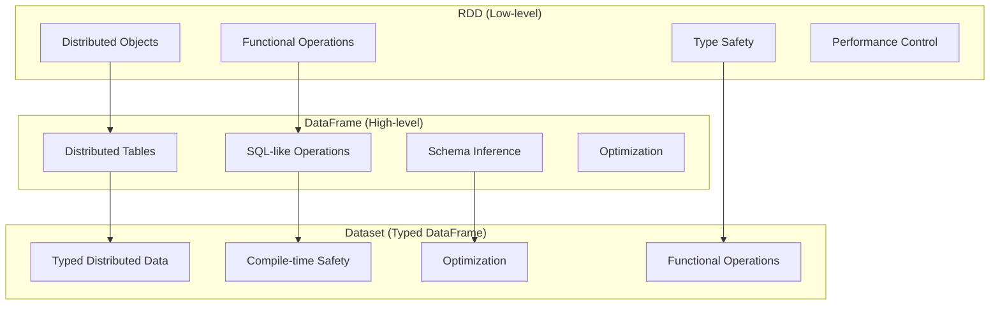

### Spark Job Execution Flow
```mermaid
sequenceDiagram
    participant Driver
    participant DAG
    participant Task
    participant Executor
    participant Worker

    Driver->>DAG: Submit Job
    DAG->>DAG: Create Stages
    DAG->>Task: Create Tasks
    Task->>Executor: Send Tasks
    Executor->>Worker: Execute Tasks
    Worker-->>Executor: Task Results
    Executor-->>Task: Results
    Task-->>DAG: Stage Complete
    DAG-->>Driver: Job Complete
```

## Design Patterns in Scala

### Cake Pattern (Dependency Injection)
```mermaid
classDiagram
    class UserServiceComponent {
        +UserService userService
    }

    class UserRepositoryComponent {
        +UserRepository userRepository
    }

    class DatabaseComponent {
        +Database database
    }

    class Application {
        +UserServiceComponent
        +UserRepositoryComponent
        +DatabaseComponent
    }

    UserServiceComponent ..> UserRepositoryComponent : depends on
    UserRepositoryComponent ..> DatabaseComponent : depends on
    Application ..> UserServiceComponent : mixes in
    Application ..> UserRepositoryComponent : mixes in
    Application ..> DatabaseComponent : mixes in
```

### Type Class Pattern Implementation
```mermaid
classDiagram
    class JsonWriter~T~ {
        +write(value: T): Json
    }

    class JsonWriter$ {
        +write[T](value: T)(implicit writer: JsonWriter[T]): Json
    }

    class Person {
        +String name
        +Int age
    }

    class PersonJsonWriter {
        +write(value: Person): Json
    }

    JsonWriter <|-- PersonJsonWriter : implements
    JsonWriter ..> Person : type parameter
    JsonWriter$ ..> JsonWriter~T~ : uses
```

### Functional Design Patterns
```mermaid
flowchart TD
    subgraph "Monad Pattern"
        M1[Option] --> M2[Some/Any]
        M1 --> M3[None]
        M4[map] --> M5[flatMap]
        M5 --> M6[for-comprehension]
    end

    subgraph "Reader Pattern"
        R1[Configuration] --> R2[Reader Monad]
        R2 --> R3[Dependency Injection]
        R3 --> R4[Environment Passing]
    end

    subgraph "Free Monad Pattern"
        F1[DSL Definition] --> F2[Free Monad]
        F2 --> F3[Interpreter]
        F3 --> F4[Execution]
    end
```

## Scala Ecosystem Integration

### Microservices Architecture with Akka
```mermaid
graph TB
    subgraph "API Gateway"
        GW[Play Framework]
    end

    subgraph "Service Discovery"
        SD[Akka Cluster]
    end

    subgraph "Microservices"
        MS1[User Service]
        MS2[Order Service]
        MS3[Product Service]
        MS4[Payment Service]
    end

    subgraph "Data Layer"
        DB1[(User DB)]
        DB2[(Order DB)]
        DB3[(Product DB)]
        DB4[(Payment DB)]
    end

    subgraph "Message Bus"
        MB[Kafka/Akka Streams]
    end

    GW --> SD
    SD --> MS1
    SD --> MS2
    SD --> MS3
    SD --> MS4

    MS1 --> DB1
    MS2 --> DB2
    MS3 --> DB3
    MS4 --> DB4

    MS1 --> MB
    MS2 --> MB
    MS3 --> MB
    MS4 --> MB

    MB --> MS1
    MB --> MS2
    MB --> MS3
    MB --> MS4
```

### Big Data Pipeline with Spark
```mermaid
graph LR
    subgraph "Data Sources"
        S1[S3]
        S2[Kafka]
        S3[HDFS]
        S4[RDBMS]
    end

    subgraph "Ingestion"
        I1[Spark Streaming]
        I2[Structured Streaming]
    end

    subgraph "Processing"
        P1[Spark Core]
        P2[Spark SQL]
        P3[MLlib]
        P4[GraphX]
    end

    subgraph "Storage"
        ST1[Parquet]
        ST2[Delta Lake]
        ST3[S3]
        ST4[HDFS]
    end

    subgraph "Consumption"
        C1[BI Tools]
        C2[APIs]
        C3[Real-time Apps]
        C4[ML Models]
    end

    S1 --> I1
    S2 --> I2
    S3 --> P1
    S4 --> P2

    I1 --> P1
    I2 --> P2

    P1 --> ST1
    P2 --> ST2
    P3 --> ST3
    P4 --> ST4

    ST1 --> C1
    ST2 --> C2
    ST3 --> C3
    ST4 --> C4
```

This visual guide provides comprehensive diagrams covering Scala language features, object-oriented programming, functional programming, advanced features, concurrency, and key ecosystem components including Akka, Play Framework, and Apache Spark.
