# Git Version Control Visual Architecture Guide

## Git Architecture Overview

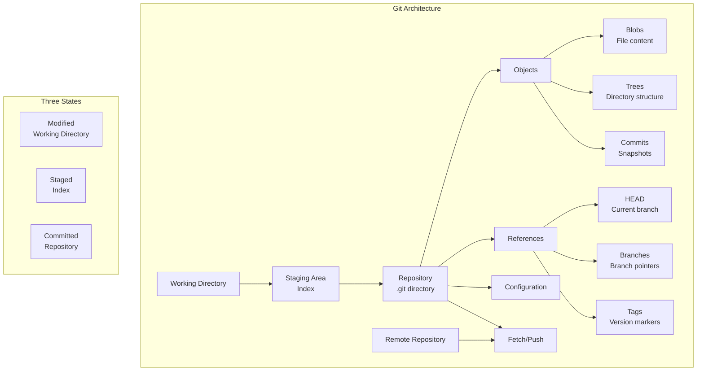

## Repository Structure

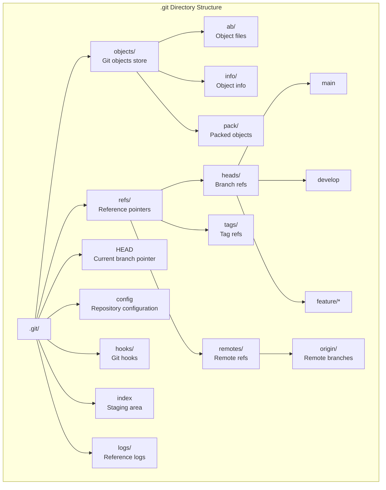

## Git Object Model

```mermaid
graph TD
    subgraph "Git Objects"
        A[Blob<br/>File Content<br/>SHA-1: a1b2c3...] --> D[Tree<br/>Directory Structure<br/>SHA-1: d4e5f6...]
        B[Blob<br/>Another File<br/>SHA-1: g7h8i9...] --> D

        D --> E[Commit<br/>Snapshot<br/>SHA-1: j0k1l2...]

        F[Tree<br/>Subdirectory<br/>SHA-1: m3n4o5...] --> D

        E --> G[Parent Commit<br/>SHA-1: p6q7r8...]

        H[Author<br/>John Doe<br/>2023-01-01] --> E
        I[Committer<br/>Jane Smith<br/>2023-01-01] --> E
        J[Message<br/>"Initial commit"] --> E
    end

    subgraph "Object Storage"
        K[Loose Objects] --> L[.git/objects/ab/cdef...]
        M[Packed Objects] --> N[.git/objects/pack/*.pack]
        N --> O[.git/objects/pack/*.idx]
    end
```

## Branching Model

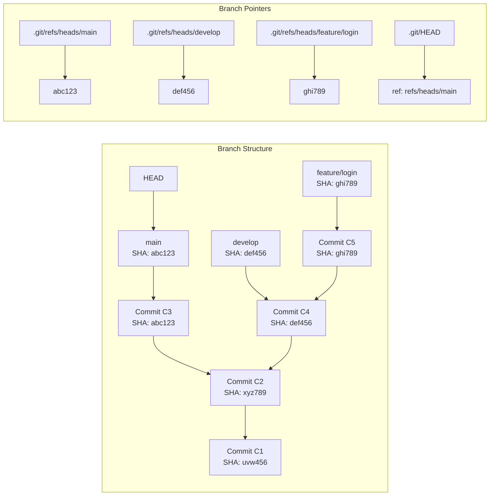

## Merge Strategies

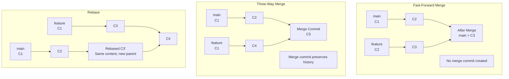

## Distributed Architecture

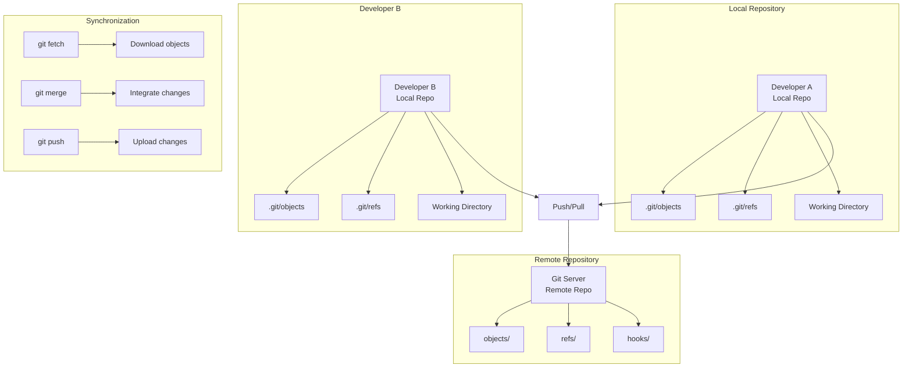

## Git Workflow Patterns

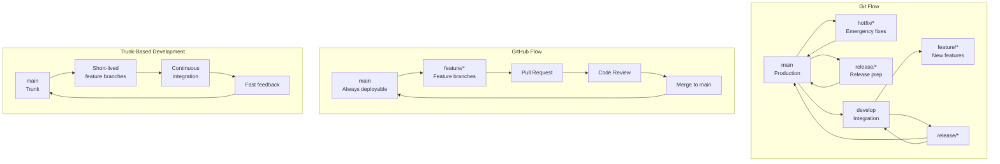

## Conflict Resolution Flow

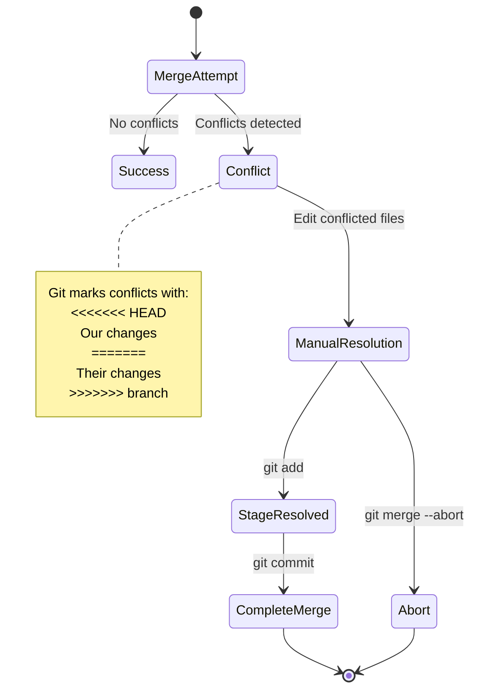

## Commit Graph Structure

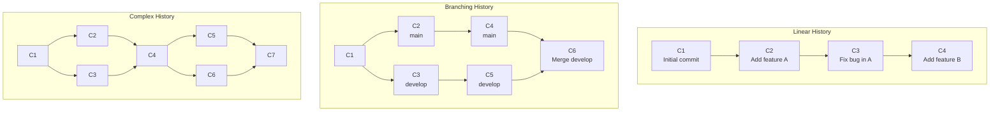

## Remote Operations Architecture

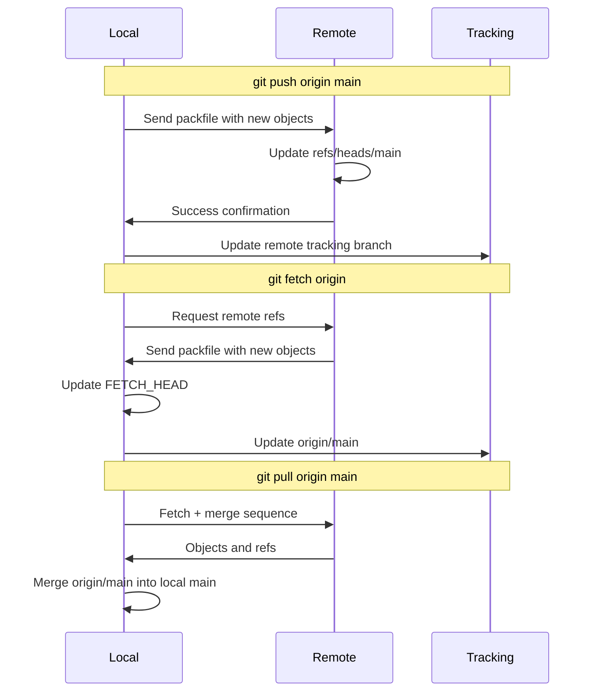

## Git Hooks Architecture

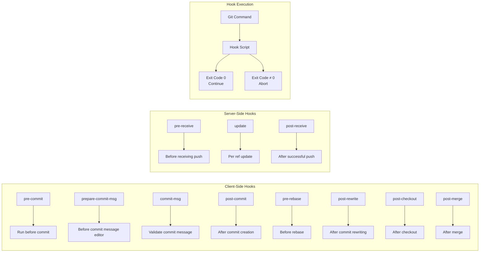

## Performance Optimization

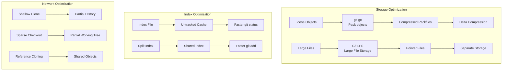

## Security Architecture

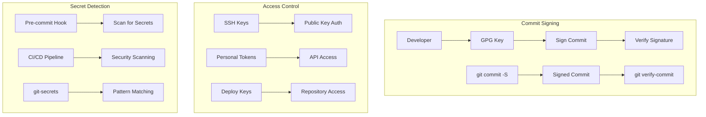

## Backup and Recovery

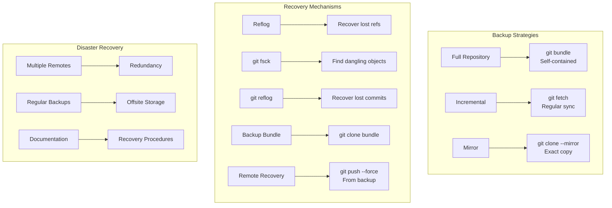

## Git with CI/CD

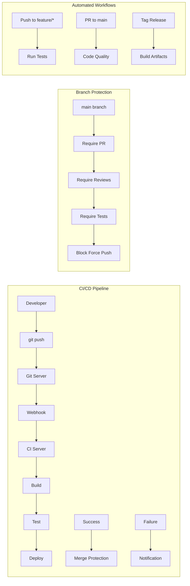

## Repository Maintenance

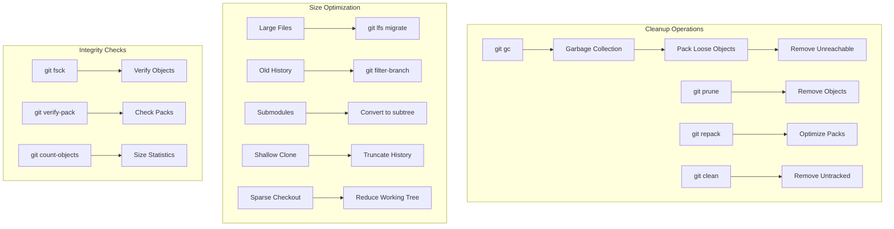

## Advanced Features

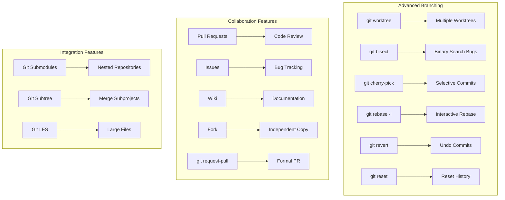

## Git Ecosystem

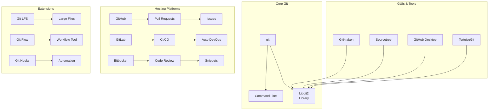

This visual guide provides comprehensive architectural diagrams covering Git's internal structure, workflows, operations, and ecosystem integration.
