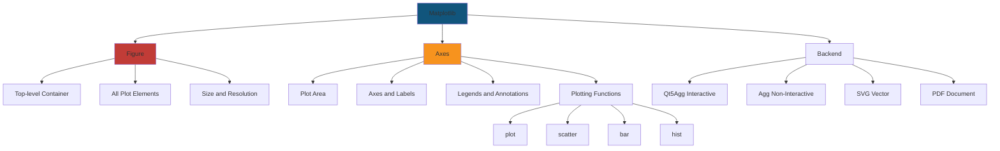
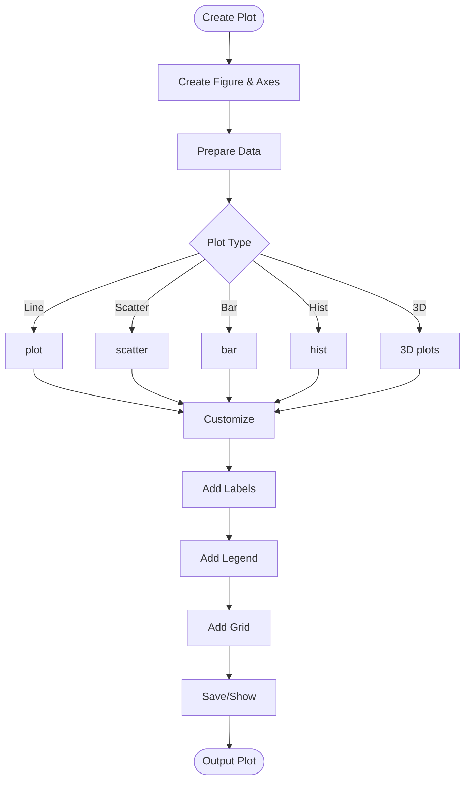
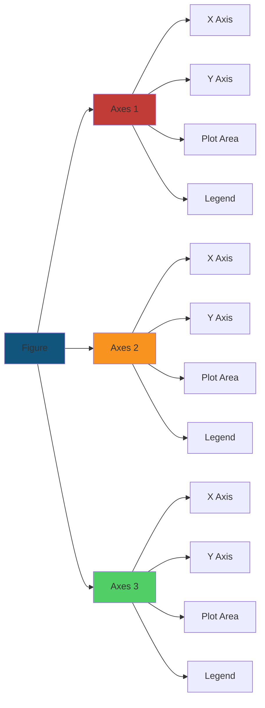
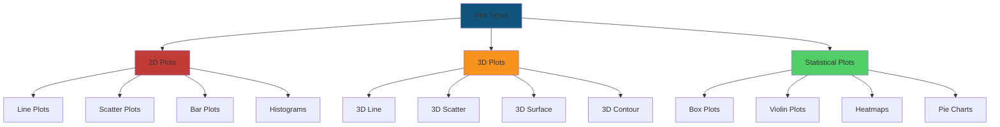
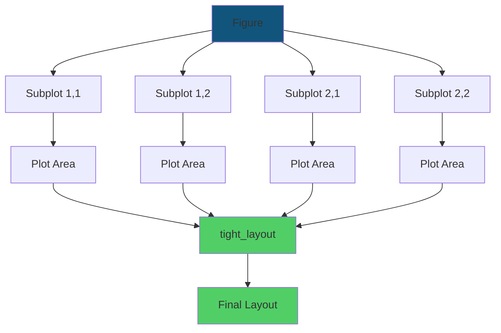
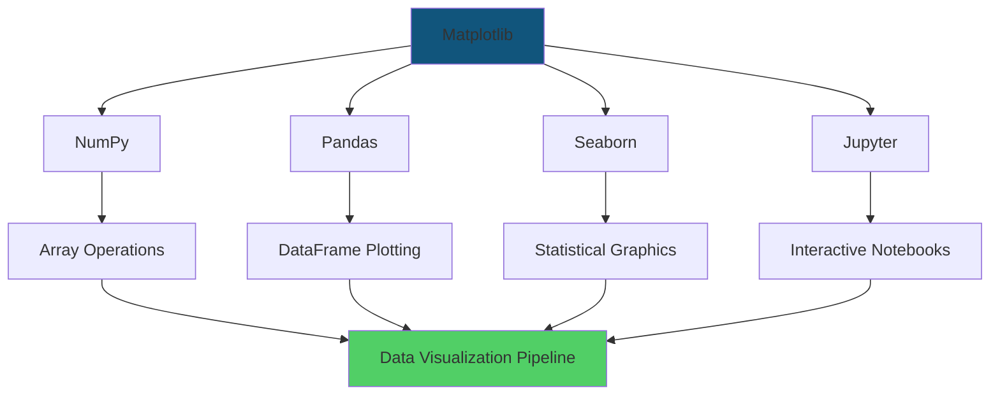
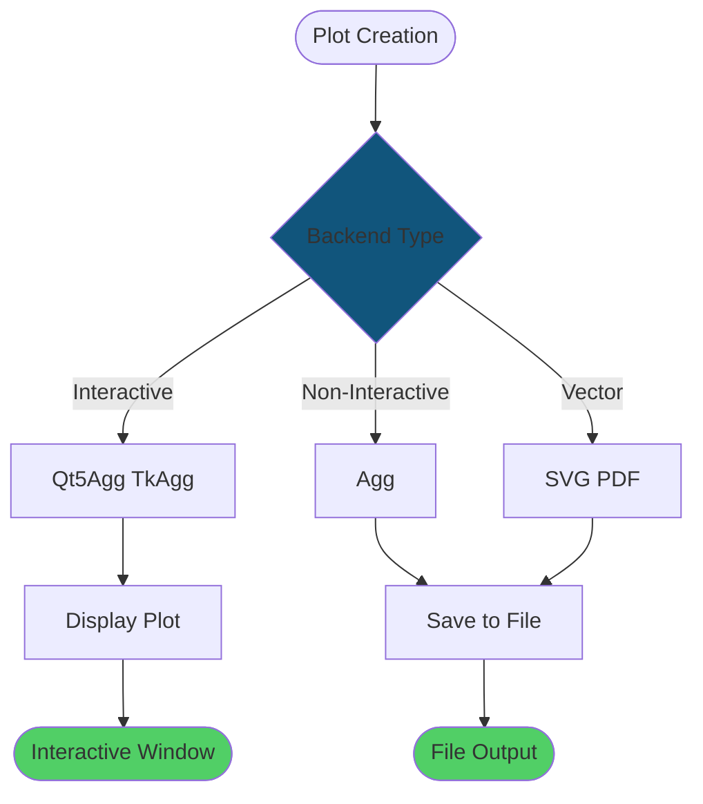
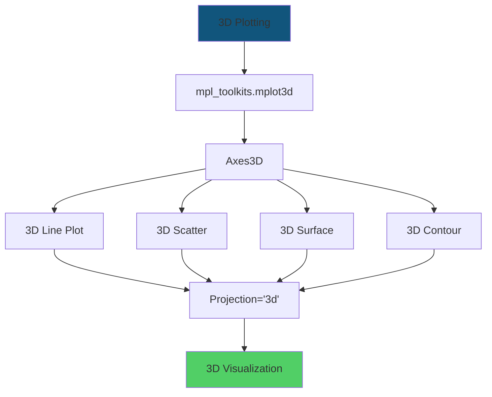
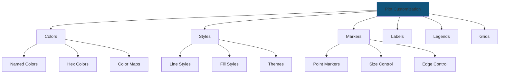
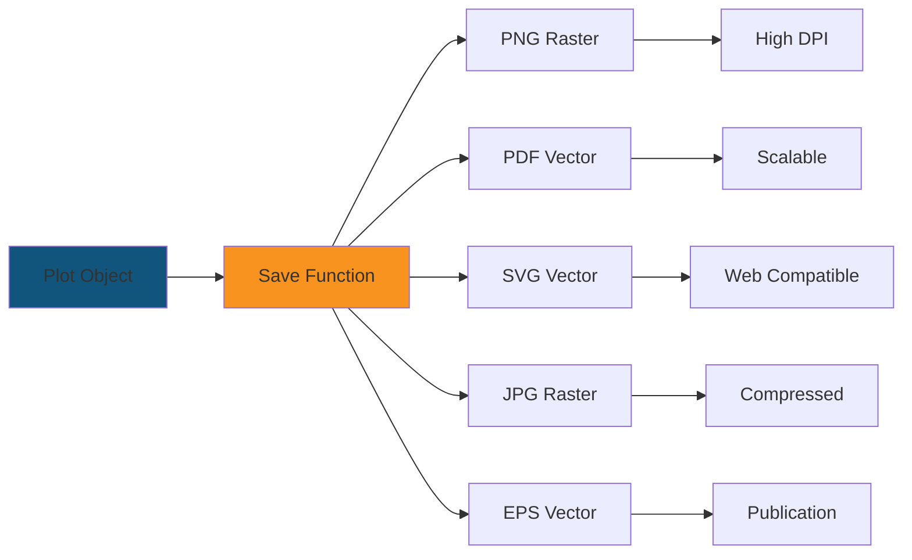

# Matplotlib: Visual Guide

## Architecture Diagrams

### Matplotlib Architecture

### Plot Creation Flow

### Figure and Axes Structure

### Plot Types Hierarchy

### Subplot Layout

### Customization Workflow

### Matplotlib Ecosystem Integration

### Backend Selection Flow

### 3D Plotting Architecture

### Plot Customization Options

### Save Format Options

