# NumPy: Visual Guide

## Architecture Diagrams

### NumPy Array Architecture

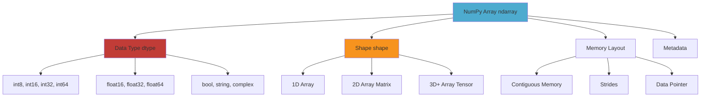

### Array Creation Flow

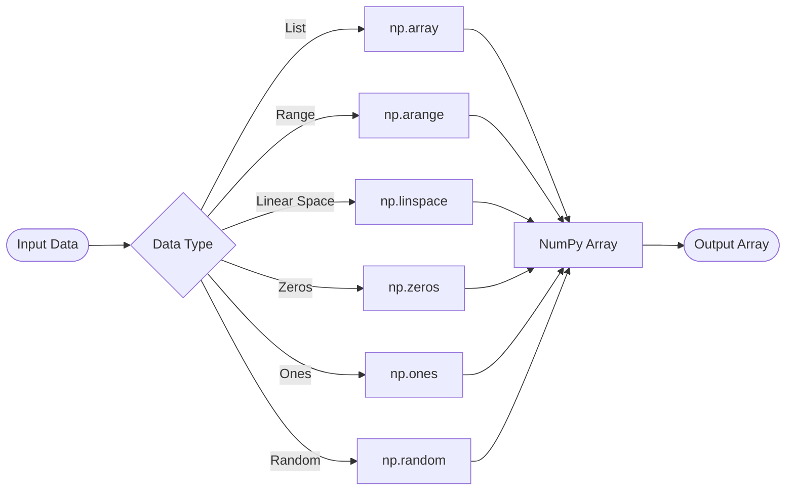

### Array Operations Hierarchy

```mermaid
graph TD
    A[NumPy Operations] --> B[Array Creation]
    A --> C[Indexing & Slicing]
    A --> D[Mathematical Operations]
    A --> E[Array Manipulation]
    A --> F[Linear Algebra]
    A --> G[Statistical Operations]
    
    B --> B1[np.array, np.zeros, np.ones]
    B --> B2[np.arange, np.linspace]
    B --> B3[np.random, np.full]
    
    C --> C1[Basic Indexing arr[i]]
    C --> C2[Slicing arr[start:end]]
    C --> C3[Boolean Indexing arr[mask]]
    C --> C4[Fancy Indexing arr[indices]]
    
    D --> D1[Element-wise +, -, *, /]
    D --> D2[Universal Functions ufuncs]
    D --> D3[Broadcasting]
    D --> D4[Aggregations sum, mean, std]
    
    E --> E1[Reshaping reshape]
    E --> E2[Transposing T, transpose]
    E --> E3[Concatenation concat, vstack, hstack]
    E --> E4[Splitting split, vsplit, hsplit]
    
    F --> F1[Matrix Multiplication dot, @]
    F --> F2[Matrix Inverse inv]
    F --> F3[Eigenvalues eig, eigh]
    F --> F4[SVD svd]
    
    G --> G1[Mean, Median mean, median]
    G --> G2[Std, Var std, var]
    G --> G3[Min, Max min, max]
    G --> G4[Percentiles percentile]
    
    style A fill:#4DABCF
    style D fill:#C13C37
    style F fill:#F7931E
```

### Broadcasting Mechanism

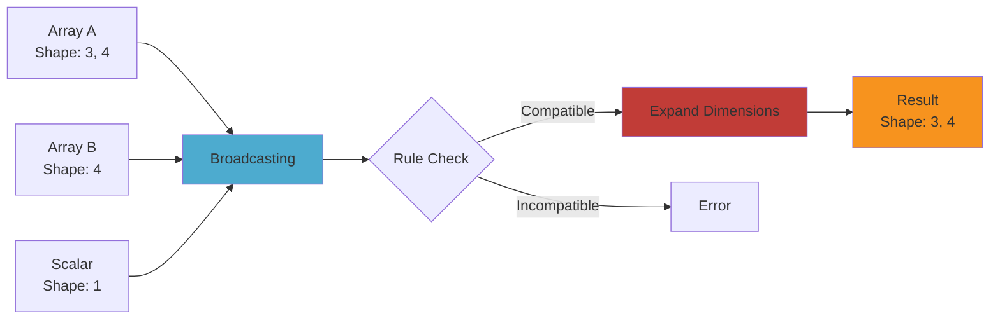

### Memory Layout and Performance

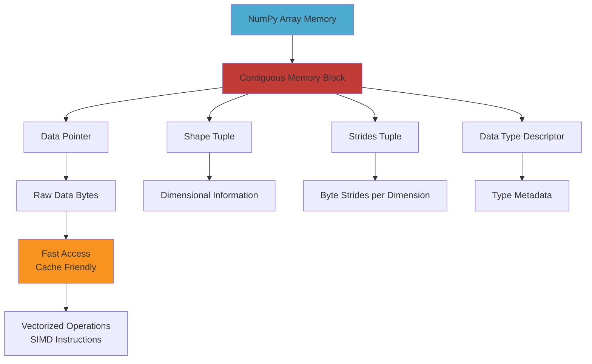

### Vectorization vs Loops

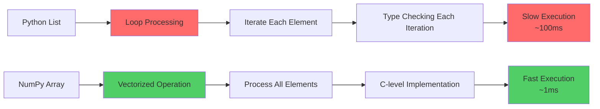

### Array Manipulation Workflow

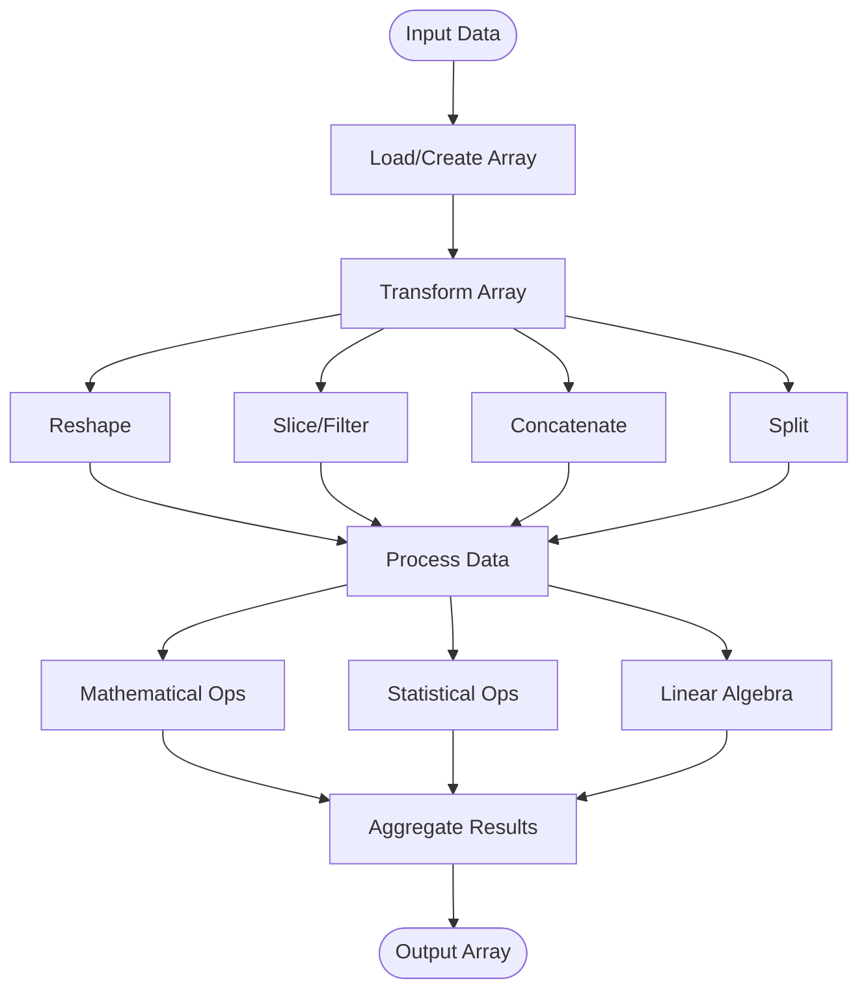

### NumPy Ecosystem Integration

```mermaid
graph TD
    A[NumPy] --> B[Pandas]
    A --> C[Matplotlib]
    A --> D[SciPy]
    A --> E[scikit-learn]
    A --> F[PyTorch/TensorFlow]
    
    B --> G[DataFrame Operations]
    C --> H[Data Visualization]
    D --> I[Scientific Computing]
    E --> J[Machine Learning]
    F --> K[Deep Learning]
    
    style A fill:#4DABCF
    style B fill:#150458
    style C fill:#11557C
```

### Array Operations Performance Comparison

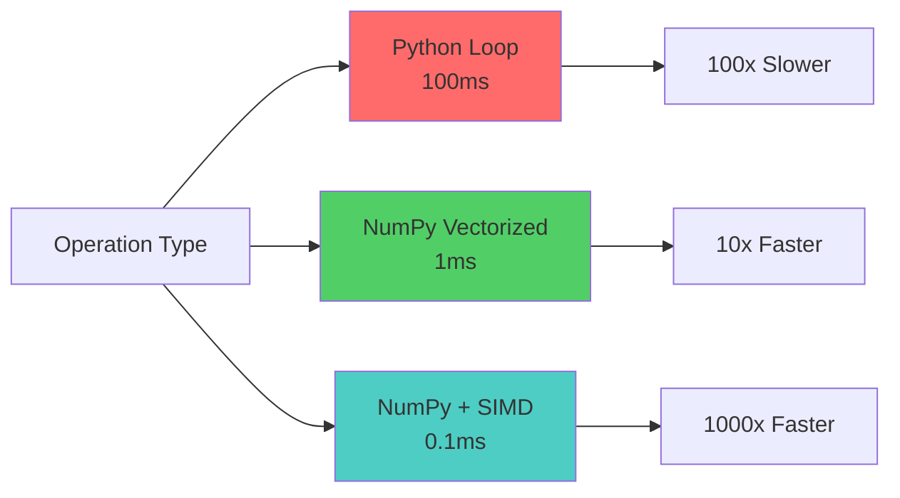

## Array Shape Transformations

### Reshaping Operations

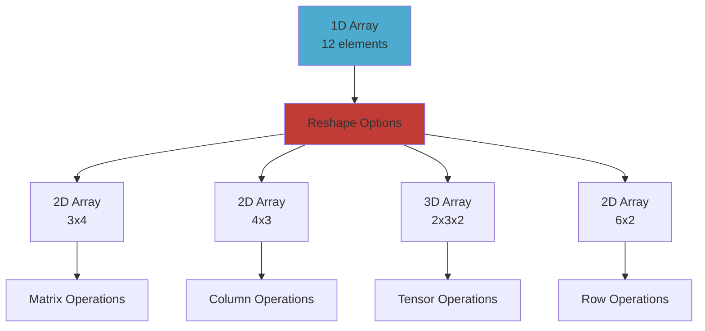

## Broadcasting Rules Visualization

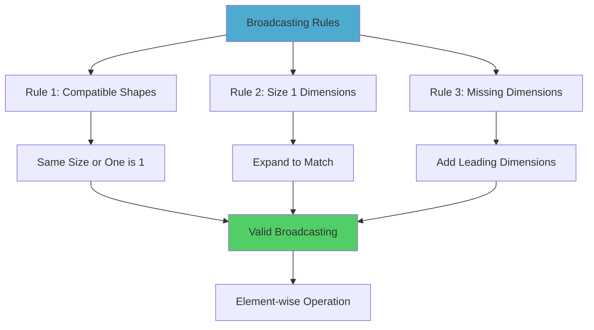

## Use Cases Flow

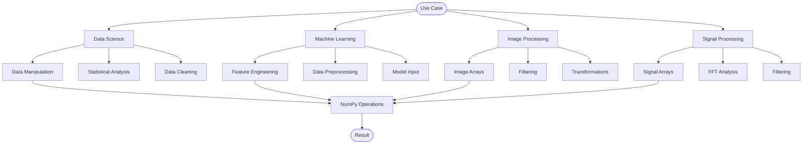


