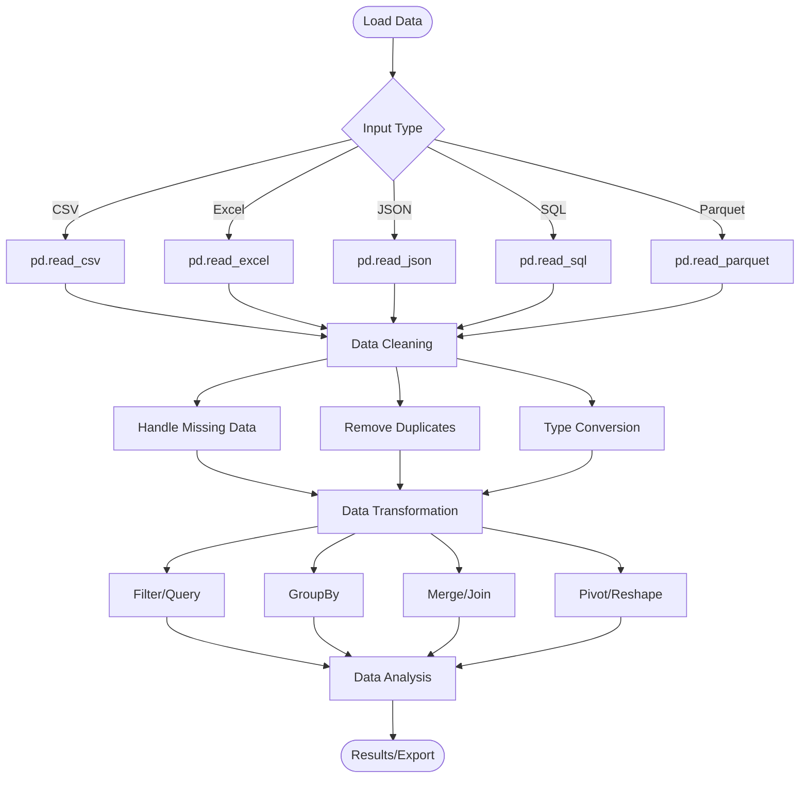
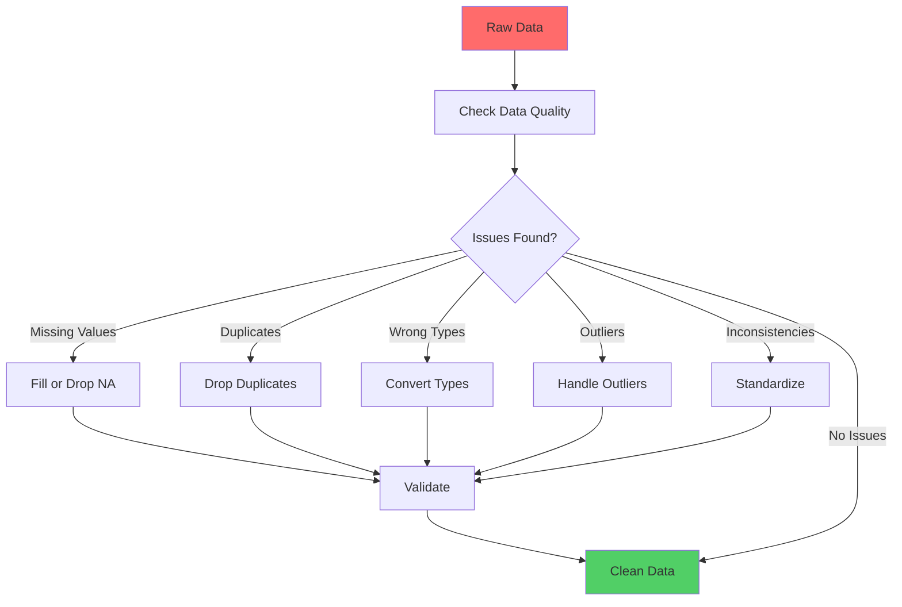
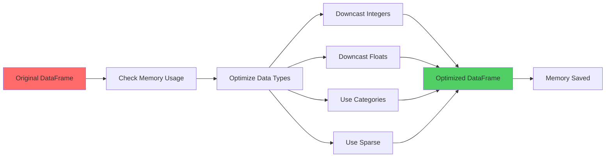

# Pandas: Visual Guide

## Architecture Diagrams

### Pandas Data Structure Architecture

```mermaid
graph TD
    A[Pandas Library] --> B[Series]
    A --> C[DataFrame]
    A --> D[Index]
    
    B --> B1[1D Labeled Array]
    B --> B2[Single Data Type]
    B --> B3[Index Alignment]
    
    C --> C1[2D Labeled Structure]
    C --> C2[Multiple Columns]
    C --> C3[Heterogeneous Types]
    C --> C4[Row & Column Index]
    
    D --> D1[Row Index]
    D --> D2[Column Index]
    D --> D3[MultiIndex Support]
    
    B --> E[NumPy Array Base]
    C --> E
    E --> F[C-level Performance]
    
    style A fill:#150458
    style B fill:#C13C37
    style C fill:#F7931E
```



### DataFrame Operations Flow



### DataFrame vs Series

```mermaid
graph LR
    A[DataFrame] --> A1[2D Structure]
    A --> A2[Multiple Columns]
    A --> A3[Columns have Names]
    A --> A4[Rows have Index]
    
    B[Series] --> B1[1D Structure]
    B --> B2[Single Column]
    B --> B3[Has Index]
    B --> B4[Can become DataFrame Column]
    
    A --> C[Collection of Series]
    C --> B
    
    style A fill:#150458
    style B fill:#C13C37
    style C fill:#F7931E
```



### Indexing and Selection Methods

```mermaid
graph TD
    A[Selection Methods] --> B[loc]
    A --> C[iloc]
    A --> D[Boolean Indexing]
    A --> E[Query]
    
    B --> B1[Label-based]
    B --> B2[Includes End]
    B --> B3[df.loc[row, col]]
    
    C --> C1[Integer Position]
    C --> C2[Excludes End]
    C --> C3[df.iloc[row, col]]
    
    D --> D1[Conditional Selection]
    D --> D2[df[df['col'] > value]]
    D --> D3[Multiple Conditions]
    
    E --> E1[String Expression]
    E --> E2[df.query('condition')]
    E --> E3[More Readable]
    
    style A fill:#150458
    style B fill:#C13C37
    style C fill:#F7931E
```

### GroupBy Operations

```mermaid
graph TD
    A[GroupBy Operation] --> B[Split]
    B --> C[Apply Function]
    C --> D[Combine Results]
    
    B --> B1[df.groupby 'key']
    B --> B2[df.groupby ['key1', 'key2']]
    B --> B3[df.groupby func]
    
    C --> C1[Aggregation]
    C --> C2[Transformation]
    C --> C3[Filtering]
    C --> C4[Applying]
    
    C1 --> D1[sum, mean, count]
    C2 --> D2[transform]
    C3 --> D3[filter]
    C4 --> D4[apply]
    
    D1 --> Result[Result DataFrame]
    D2 --> Result
    D3 --> Result
    D4 --> Result
    
    style A fill:#150458
    style Result fill:#51CF66
```

### Merging and Joining

```mermaid
graph TD
    A[DataFrame 1] --> Merge[Merge Operation]
    B[DataFrame 2] --> Merge
    
    Merge --> Type{Join Type}
    
    Type -->|Inner| Inner[Common Keys Only]
    Type -->|Left| Left[All Left + Matching Right]
    Type -->|Right| Right[All Right + Matching Left]
    Type -->|Outer| Outer[All Keys from Both]
    
    Inner --> Result[Result DataFrame]
    Left --> Result
    Right --> Result
    Outer --> Result
    
    style Merge fill:#150458
    style Result fill:#51CF66
```



### Pivot Table Operations

```mermaid
graph LR
    A[Long Format Data] --> Pivot[Pivot Operation]
    Pivot --> B[Wide Format]
    
    Pivot --> P1[Values Column]
    Pivot --> P2[Index Rows]
    Pivot --> P3[Columns]
    Pivot --> P4[Aggregation Function]
    
    P1 --> B
    P2 --> B
    P3 --> B
    P4 --> B
    
    B --> C[Pivot Table]
    
    C --> Melt[Melt Operation]
    Melt --> A
    
    style Pivot fill:#150458
    style C fill:#51CF66
```



### Time Series Operations

```mermaid
graph TD
    A[Datetime Data] --> B[Set as Index]
    B --> C[Time Series Operations]
    
    C --> C1[Resampling]
    C --> C2[Shifting]
    C --> C3[Rolling Windows]
    C --> C4[Time Zone Handling]
    
    C1 --> D1[Daily, Weekly, Monthly]
    C2 --> D2[Lag/Lead Data]
    C3 --> D3[Moving Averages]
    C4 --> D4[Convert Timezones]
    
    D1 --> Result[Time Series Analysis]
    D2 --> Result
    D3 --> Result
    D4 --> Result
    
    style A fill:#150458
    style Result fill:#51CF66
```



### Data Cleaning Workflow



### Memory Optimization Strategy



### Pandas Ecosystem Integration

```mermaid
graph TD
    A[Pandas] --> B[NumPy]
    A --> C[Matplotlib]
    A --> D[Seaborn]
    A --> E[scikit-learn]
    A --> F[Jupyter]
    
    B --> G[Array Operations]
    C --> H[Visualization]
    D --> H
    E --> I[Machine Learning]
    F --> J[Interactive Analysis]
    
    G --> K[Data Processing Pipeline]
    H --> K
    I --> K
    J --> K
    
    style A fill:#150458
    style K fill:#51CF66
```




