# Visual Studio Code Architecture Guide

## VS Code Architecture Overview

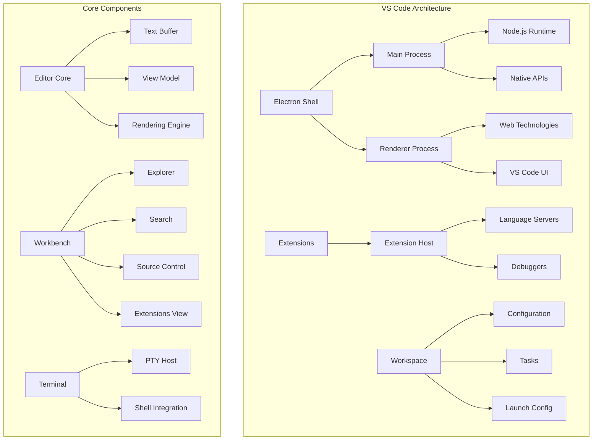

## Extension Architecture

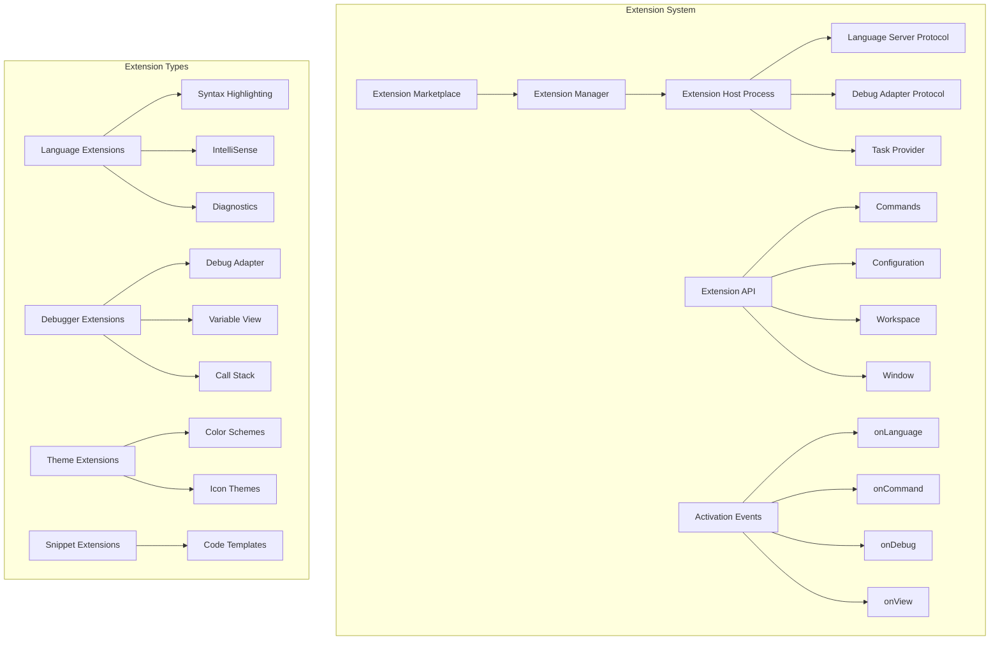

## Language Server Protocol

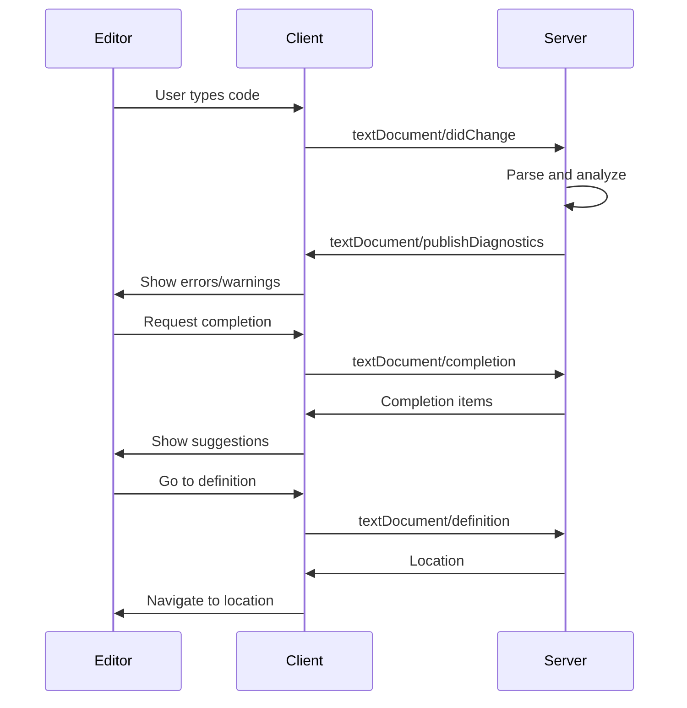

## Debug Architecture

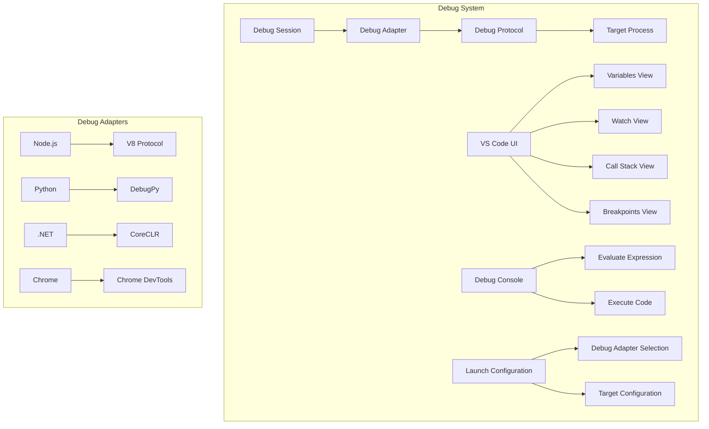

## File System and Workspace

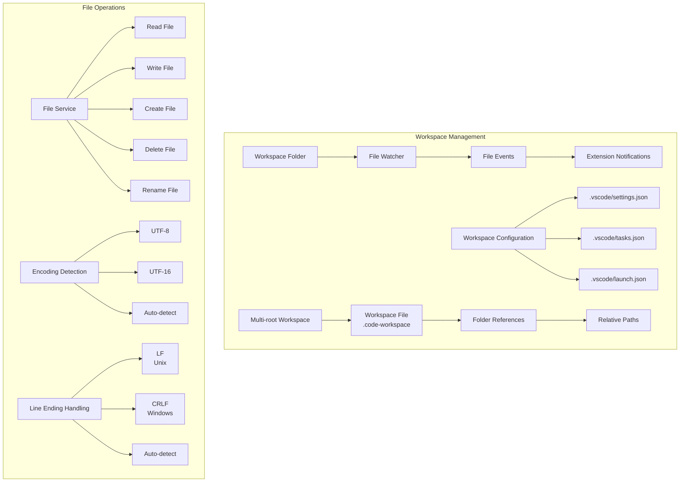

## UI Architecture

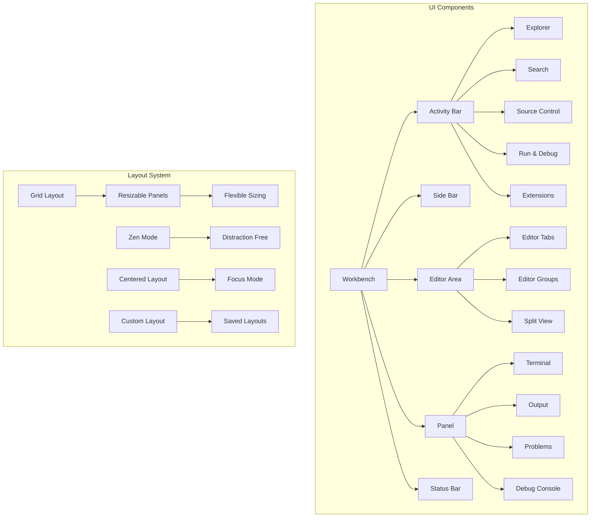

## Configuration System

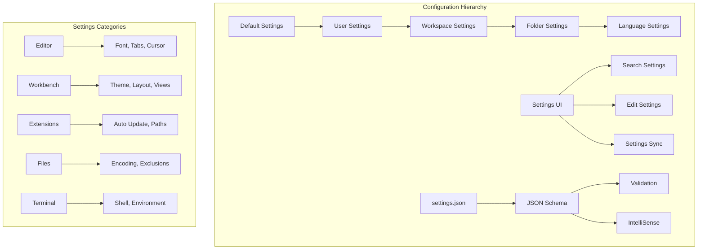

## Task and Build System

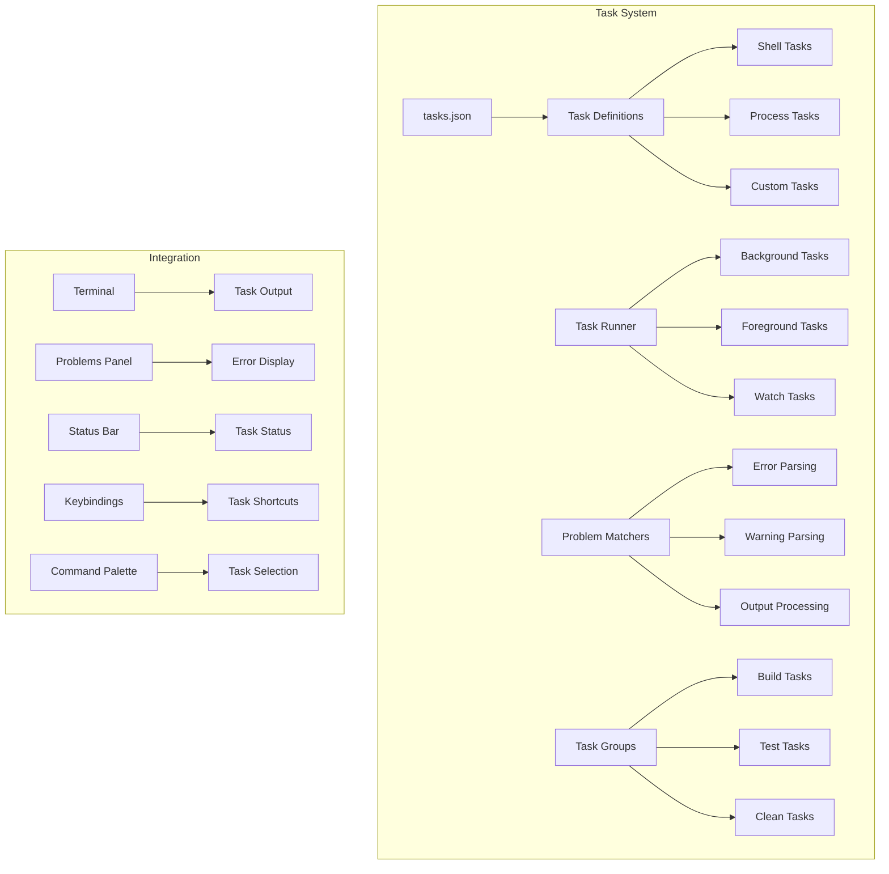

## Git Integration Architecture

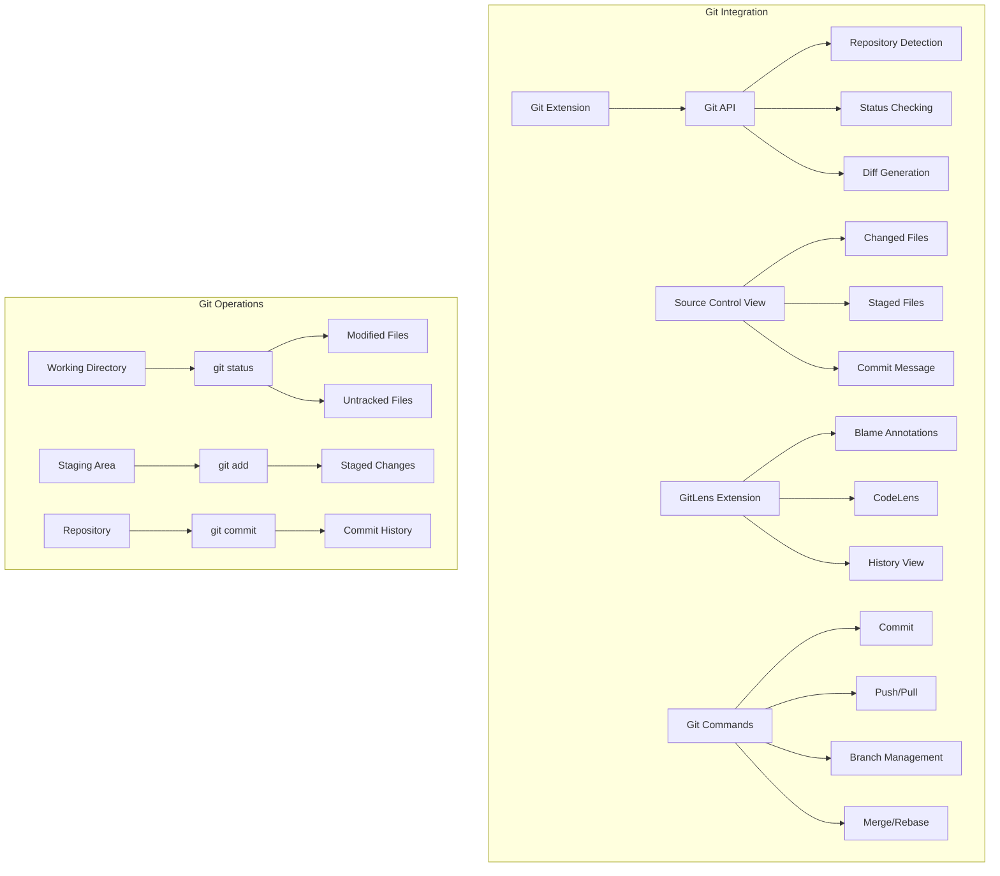

## Terminal Architecture

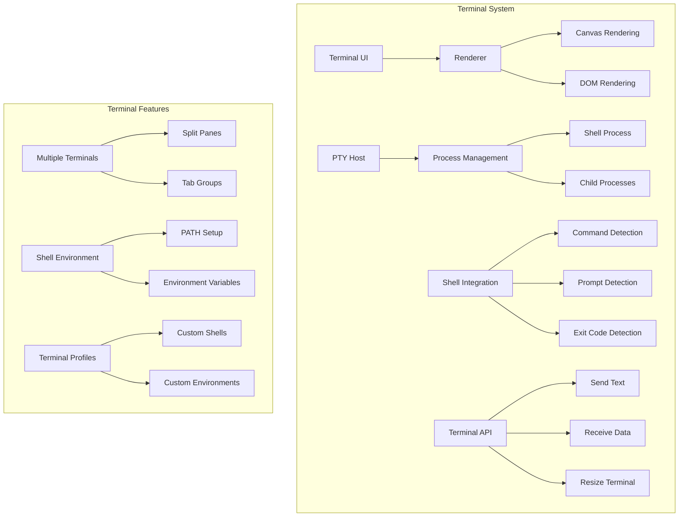

## Extension Development

```mermaid
graph TB
    subgraph "Extension Development"
        A[Extension Project] --> B[package.json]
        B --> C[Extension Manifest]
        C --> D[Activation Events]
        C --> E[Contributes]

        F[Extension Code] --> G[Main Entry Point]
        G --> H[activate() Function]
        G --> I[deactivate() Function]

        J[VS Code API] --> K[vscode Namespace]
        J --> L[Commands]
        J --> M[Window]
        J --> N[Workspace]

        O[Testing] --> P[Extension Test Runner]
        O --> Q[VS Code Test API]
    end

    subgraph "Publishing"
        R[vsce Tool] --> S[Package Extension]
        S --> T[Publish to Marketplace]

        U[Extension Marketplace] --> V[Discovery]
        U --> W[Installation]
        U --> X[Updates]
    end
```

## Performance Architecture

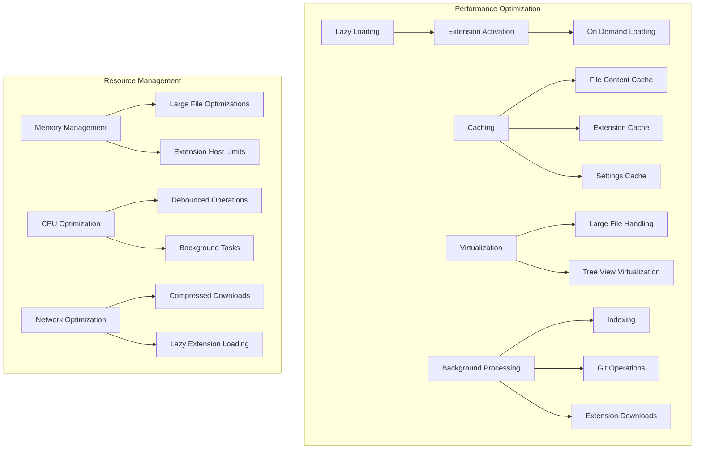

## Remote Development

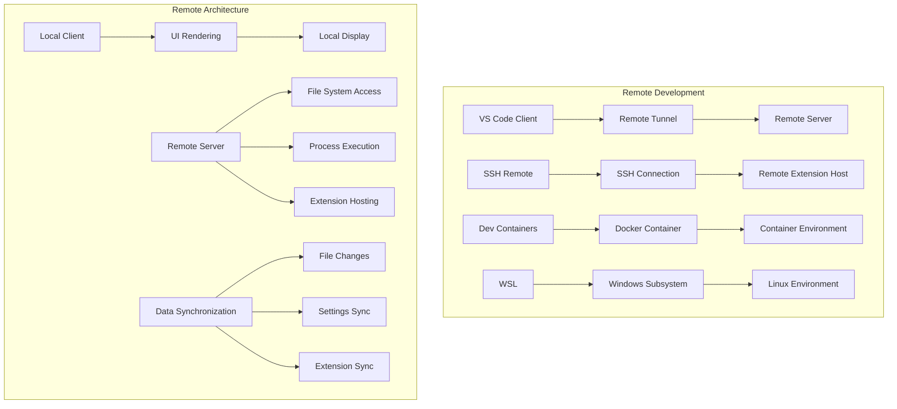

## Security Architecture

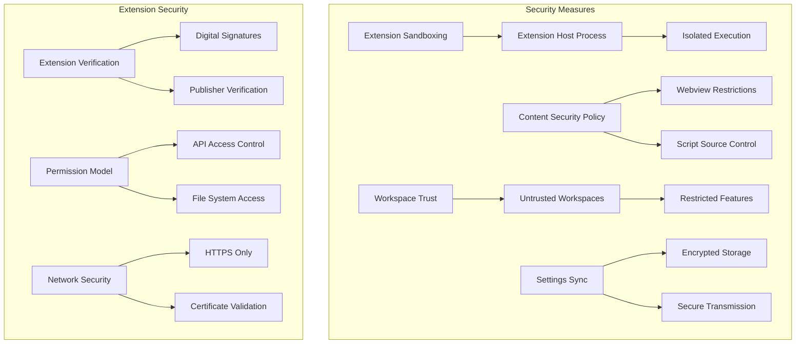

## Plugin Architecture

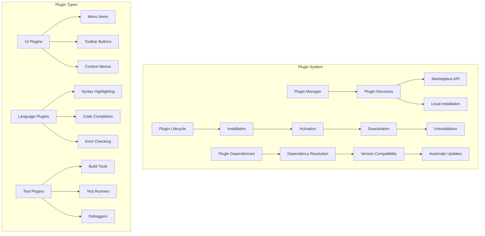

## Data Flow Architecture

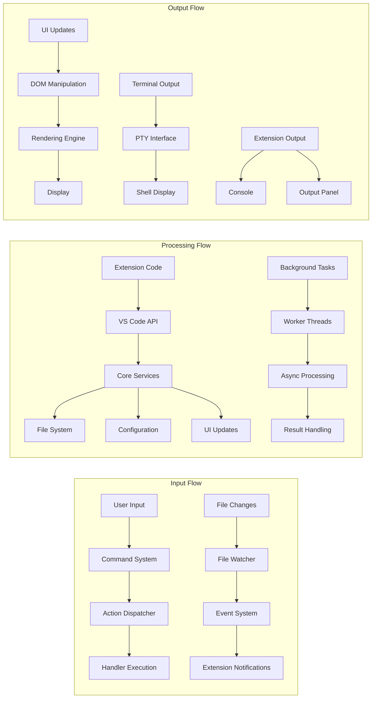

This visual guide provides comprehensive architectural diagrams covering VS Code's core systems, extension architecture, remote development, and performance optimization.
