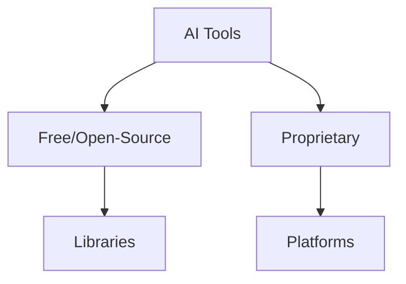
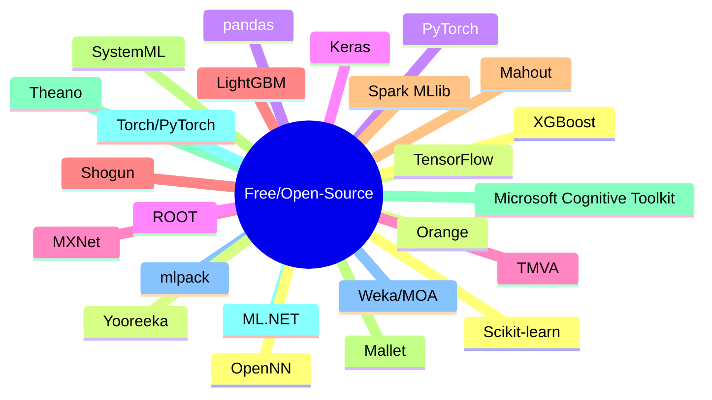
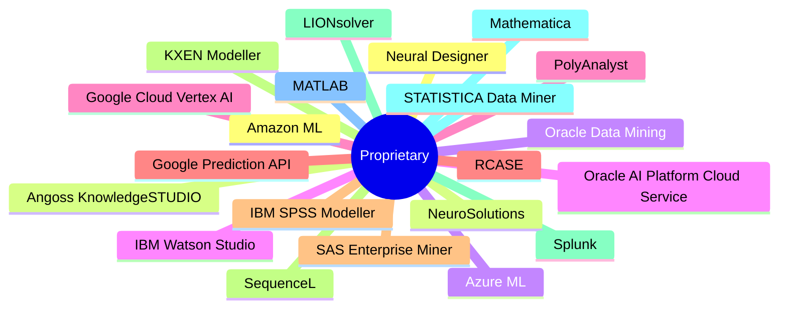

# Tools Guide

## Table of Contents
- [Introduction](#introduction)
- [Free/Open-Source Software](#freeopen-source-software)
- [Proprietary Software](#proprietary-software)

## Introduction
Tools for AI include software libraries, frameworks, and platforms for machine learning, data processing, and AI development. Divided into free/open-source and proprietary.

## Free/Open-Source Software
Scikit-learn, TensorFlow, PyTorch, Keras, MXNet, LightGBM, Mahout, Mallet, Microsoft Cognitive Toolkit, ML.NET, mlpack, OpenNN, Orange, pandas, ROOT, TMVA with ROOT, Shogun, Spark MLlib, SystemML, Theano, Torch/PyTorch, Weka/MOA, XGBoost, Yooreeka.

## Proprietary Software
Amazon Machine Learning, Angoss KnowledgeSTUDIO, Azure Machine Learning, IBM Watson Studio, Google Cloud Vertex AI, Google Prediction API, IBM SPSS Modeller, KXEN Modeller, LIONsolver, Mathematica, MATLAB, Neural Designer, NeuroSolutions, Oracle Data Mining, Oracle AI Platform Cloud Service, PolyAnalyst, RCASE, SAS Enterprise Miner, SequenceL, Splunk, STATISTICA Data Miner.

