# Vertex AI Visual Architecture Guide

## Vertex AI Platform Overview

```mermaid
graph TD
    subgraph "🎯 Vertex AI Unified Platform"
        VERTEX[🎯 Vertex AI<br/>ML Platform]
        WORKBENCH[📓 Workbench<br/>Jupyter Notebooks]
        PIPELINES[🔄 Pipelines<br/>Kubeflow Integration]
        FEATURE_STORE[🏪 Feature Store<br/>Feature Management]
        MODEL_REGISTRY[📦 Model Registry<br/>Version Control]
        ENDPOINTS[🎯 Endpoints<br/>Model Serving]
    end

    subgraph "🤖 AutoML Capabilities"
        TABULAR[📊 Tabular<br/>Regression/Classification]
        IMAGE[🖼️ Image<br/>Classification/Detection]
        TEXT[📝 Text<br/>Classification/Extraction]
        VIDEO[🎥 Video<br/>Classification/Action]
        FORECASTING[📈 Forecasting<br/>Time Series]
    end

    subgraph "🔧 Custom Training"
        CUSTOM_JOBS[⚙️ Custom Jobs<br/>Container-based Training]
        HYPER_TUNING[🎛️ Hyperparameter Tuning<br/>Automated Optimization]
        DISTRIBUTED[🔀 Distributed Training<br/>Multi-node Scaling]
        PREBUILT[📦 Pre-built Containers<br/>Framework Support]
    end

    subgraph "📊 Data & Analytics"
        BIGQUERY[📊 BigQuery<br/>Data Warehouse]
        DATAFLOW[🌊 Dataflow<br/>Stream Processing]
        DATALAB[📓 Datalab<br/>Exploratory Analysis]
        DATA_LABELING[🏷️ Data Labeling<br/>Annotation Service]
    end

    subgraph "🔍 ML Operations"
        EXPERIMENTS[🧪 Experiments<br/>Tracking & Comparison]
        MONITORING[📊 Monitoring<br/>Performance & Drift]
        EXPLAINABILITY[🔍 Explainability<br/>Model Interpretability]
        BIAS_DETECTION[⚖️ Bias Detection<br/>Fairness Analysis]
    end

    VERTEX --> WORKBENCH
    VERTEX --> PIPELINES
    VERTEX --> FEATURE_STORE
    VERTEX --> MODEL_REGISTRY
    VERTEX --> ENDPOINTS

    VERTEX --> TABULAR
    VERTEX --> IMAGE
    VERTEX --> TEXT
    VERTEX --> VIDEO
    VERTEX --> FORECASTING

    VERTEX --> CUSTOM_JOBS
    VERTEX --> HYPER_TUNING
    VERTEX --> DISTRIBUTED
    VERTEX --> PREBUILT

    VERTEX --> BIGQUERY
    VERTEX --> DATAFLOW
    VERTEX --> DATALAB
    VERTEX --> DATA_LABELING

    VERTEX --> EXPERIMENTS
    VERTEX --> MONITORING
    VERTEX --> EXPLAINABILITY
    VERTEX --> BIAS_DETECTION

    style VERTEX fill:#e3f2fd,stroke:#1976d2,stroke-width:3px
    style WORKBENCH fill:#f3e5f5,stroke:#7b1fa2,stroke-width:2px
    style PIPELINES fill:#e8f5e8,stroke:#388e3c,stroke-width:2px
    style FEATURE_STORE fill:#fff3e0,stroke:#f57c00,stroke-width:2px
    style MODEL_REGISTRY fill:#fce4ec,stroke:#e91e63,stroke-width:2px
    style ENDPOINTS fill:#e1f5fe,stroke:#0277bd,stroke-width:2px
```

## AutoML Workflow

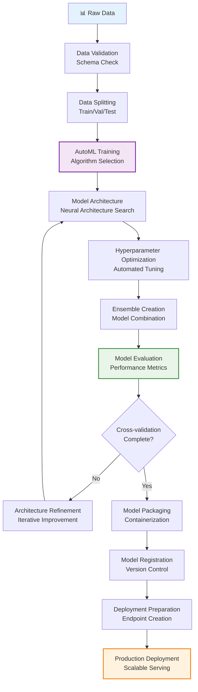

## Custom Training Architecture

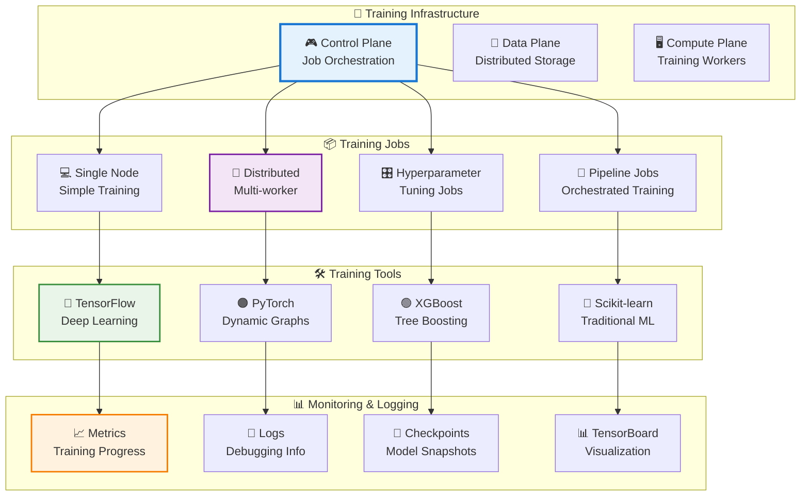

## Model Deployment Patterns

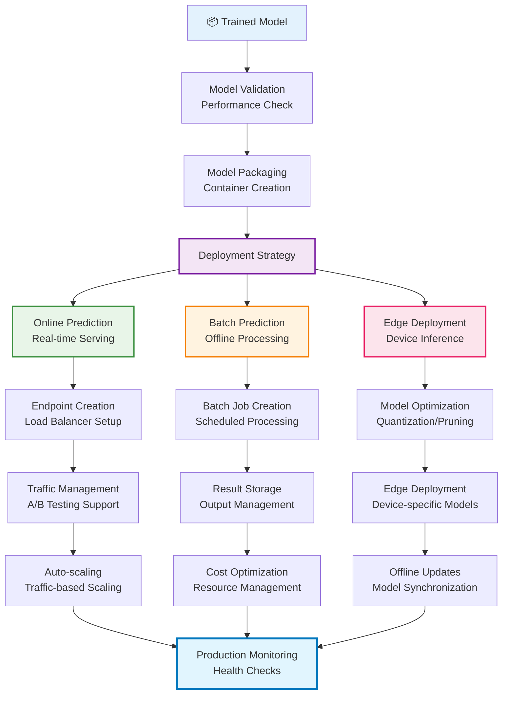

## Feature Store Architecture

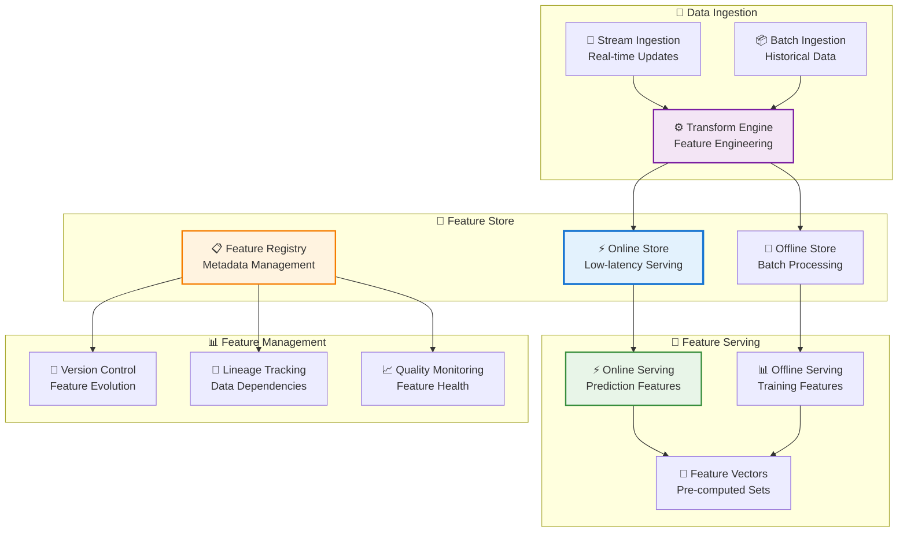

## ML Pipeline Orchestration

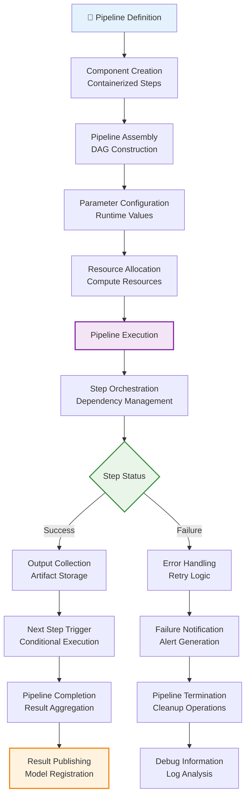

## Model Monitoring System

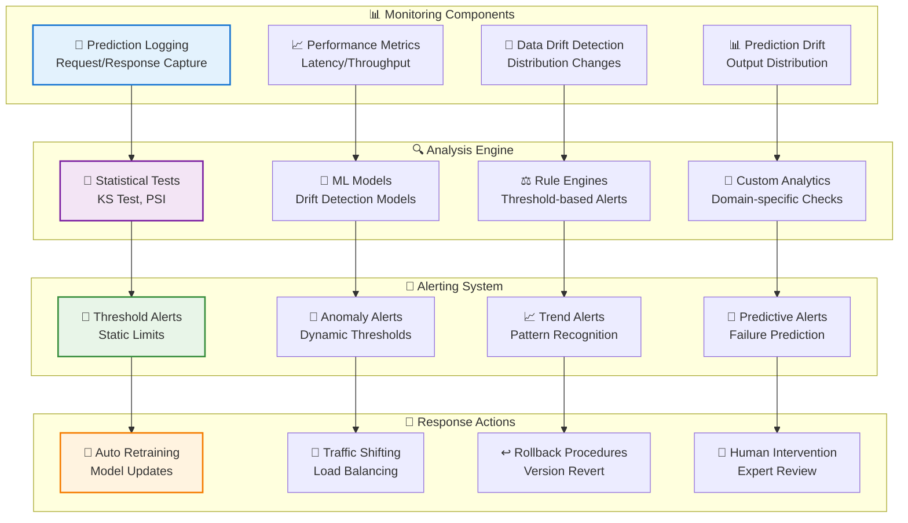

## Experiment Tracking

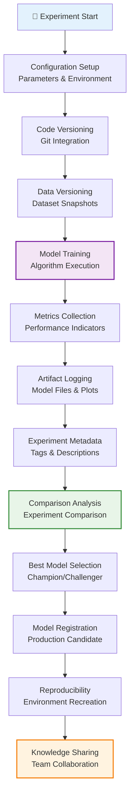

## Model Explainability Framework

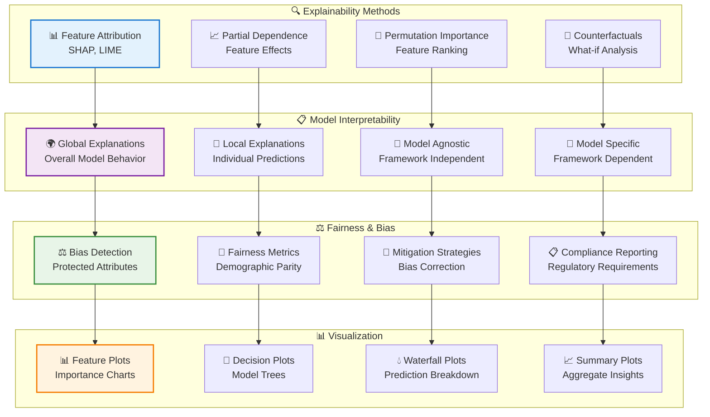

## Cost Optimization Strategies

```mermaid
graph TD
    A[💰 Cost Optimization] --> B[Compute Costs]
    A --> C[Storage Costs]
    A --> D[Network Costs]
    A --> E[Monitoring Costs]

    B --> F[Spot Instances<br/>Preemptible VMs]
    B --> G[Auto-scaling<br/>Dynamic Resources]
    B --> H[Resource Optimization<br/>Right-sizing]
    B --> I[Training Efficiency<br/>Early Stopping]

    C --> J[Data Lifecycle<br/>Automatic Cleanup]
    C --> K[Storage Classes<br/>Cost-tiered Storage]
    C --> L[Compression<br/>Data Optimization]
    C --> M[Artifact Management<br/>Version Cleanup]

    D --> N[Regional Optimization<br/>Data Locality]
    D --> O[Batch Processing<br/>Bulk Transfers]
    D --> P[Caching Strategies<br/>Reduce Egress]
    D --> Q[CDN Integration<br/>Edge Caching]

    E --> R[Selective Monitoring<br/>Targeted Metrics]
    E --> S[Alert Optimization<br/>Reduce Noise]
    E --> T[Log Management<br/>Retention Policies]
    E --> U[Sampling Strategies<br/>Reduce Volume]

    F --> V[💸 Savings Achieved]
    G --> V
    H --> V
    I --> V
    J --> V
    K --> V
    L --> V
    M --> V
    N --> V
    O --> V
    P --> V
    Q --> V
    R --> V
    S --> V
    T --> V
    U --> V

    style A fill:#e3f2fd
    style V fill:#e8f5e8,stroke:#388e3c,stroke-width:3px
```

## Security Architecture

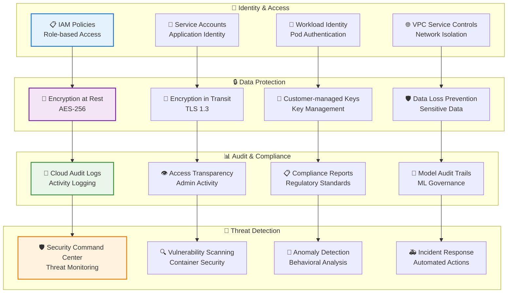

## Summary

Vertex AI's visual architecture reveals a comprehensive, integrated platform that unifies the entire machine learning lifecycle:

- **Unified Platform**: Single interface combining AutoML, custom training, and MLOps
- **AutoML Capabilities**: Automated model building across multiple data types
- **Custom Training**: Full control with distributed computing and hyperparameter tuning
- **Model Management**: Registry, versioning, and deployment orchestration
- **Feature Engineering**: Managed feature store for consistent feature serving
- **Pipeline Orchestration**: Kubeflow-based workflow automation
- **Monitoring & Observability**: Comprehensive performance and drift detection
- **Explainability**: Model interpretation and bias detection capabilities
- **Security & Compliance**: Enterprise-grade security and regulatory compliance
- **Cost Optimization**: Intelligent resource management and cost controls

The platform represents the convergence of automated ML capabilities with enterprise-grade operational features, enabling organizations to democratize AI while maintaining governance, security, and cost efficiency.