# dbt vs Similar Tools: Comprehensive Comparison

## Table of Contents
1. [Executive Summary](#executive-summary)
2. [Tool Categories](#tool-categories)
3. [Data Transformation Tools Comparison](#data-transformation-tools-comparison)
4. [Orchestration Tools Comparison](#orchestration-tools-comparison)
5. [Data Quality Tools Comparison](#data-quality-tools-comparison)
6. [ELT/ETL Tools Comparison](#eltetl-tools-comparison)
7. [Use Case Scenarios](#use-case-scenarios)
8. [Integration Patterns](#integration-patterns)
9. [Decision Matrix](#decision-matrix)

---

## Executive Summary

### Tool Ecosystem Overview

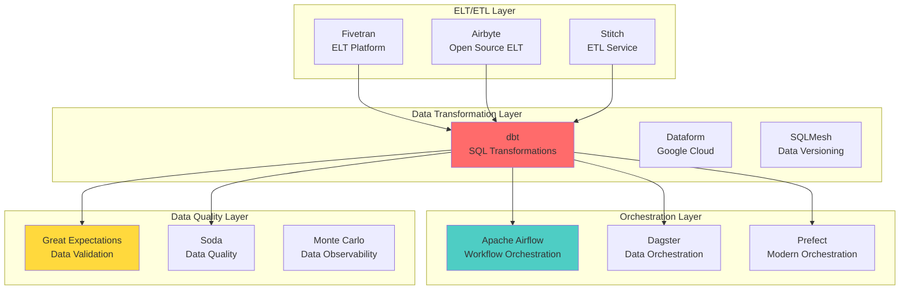

---

## Tool Categories

### Category Classification

| Category | Primary Purpose | Key Tools |
|----------|----------------|-----------|
| **Data Transformation** | Transform data in warehouse using SQL | dbt, Dataform, SQLMesh |
| **Orchestration** | Schedule and coordinate workflows | Airflow, Dagster, Prefect |
| **Data Quality** | Validate and monitor data quality | Great Expectations, Soda, Monte Carlo |
| **ELT/ETL** | Extract, Load, Transform data | Fivetran, Airbyte, Stitch |
| **Data Versioning** | Version control for data | dbt, SQLMesh, DVC |

---

## Data Transformation Tools Comparison

### Feature Comparison Table

| Feature | dbt | Dataform | SQLMesh |
|---------|-----|----------|---------|
| **Primary Language** | SQL + Jinja2 | SQL + JavaScript | SQL + Python |
| **Open Source** | ✅ Yes | ❌ No (Google Cloud) | ✅ Yes |
| **Cloud Hosting** | dbt Cloud (Paid) | Google Cloud (Paid) | Self-hosted |
| **Version Control** | Git-based | Git-based | Built-in versioning |
| **Testing Framework** | ✅ Built-in | ✅ Built-in | ✅ Built-in |
| **Documentation** | ✅ Auto-generated | ✅ Auto-generated | ✅ Auto-generated |
| **Incremental Models** | ✅ Yes | ✅ Yes | ✅ Yes |
| **Snapshots** | ✅ Yes | ❌ No | ✅ Yes |
| **Macros** | ✅ Jinja2 macros | ✅ JavaScript functions | ✅ Python functions |
| **Materializations** | Table, View, Incremental, Ephemeral | Table, View, Incremental | Table, View, Incremental |
| **Data Lineage** | ✅ Built-in | ✅ Built-in | ✅ Built-in |
| **CI/CD Integration** | ✅ Excellent | ✅ Good | ✅ Good |
| **Cost** | Free (OSS) / Paid (Cloud) | Paid (GCP) | Free (OSS) |
| **Learning Curve** | Medium | Medium | Steep |
| **Community** | ⭐⭐⭐⭐⭐ Large | ⭐⭐⭐ Medium | ⭐⭐ Small |
| **Best For** | SQL-first teams, Analytics | Google Cloud users | Advanced versioning needs |

### Architecture Comparison

```mermaid
graph TB
    subgraph "dbt Architecture"
        DBT_CLI[dbt CLI] --> DBT_PROJ[dbt Project]
        DBT_PROJ --> DBT_MODELS[SQL Models]
        DBT_MODELS --> DBT_COMPILE[Jinja2 Compiler]
        DBT_COMPILE --> DBT_RUN[Execute SQL]
        DBT_RUN --> DBT_DOCS[Generate Docs]
    end
    
    subgraph "Dataform Architecture"
        DF_CLI[Dataform CLI] --> DF_PROJ[Dataform Project]
        DF_PROJ --> DF_WORKFLOWS[Workflows]
        DF_WORKFLOWS --> DF_ACTIONS[Actions SQL/JS]
        DF_ACTIONS --> DF_COMPILE[JavaScript Compiler]
        DF_COMPILE --> DF_RUN[Execute in BigQuery]
        DF_RUN --> DF_DOCS[Generate Docs]
    end
    
    subgraph "SQLMesh Architecture"
        SM_CLI[SQLMesh CLI] --> SM_PROJ[SQLMesh Project]
        SM_PROJ --> SM_MODELS[SQL Models]
        SM_MODELS --> SM_PLAN[Plan Changes]
        SM_PLAN --> SM_VALIDATE[Validate]
        SM_VALIDATE --> SM_APPLY[Apply Changes]
        SM_APPLY --> SM_VERSION[Version Control]
    end
    
    style DBT_CLI fill:#FF6B6B
    style DF_CLI fill:#4285F4
    style SM_CLI fill:#4ECDC4
```

### Workflow Comparison

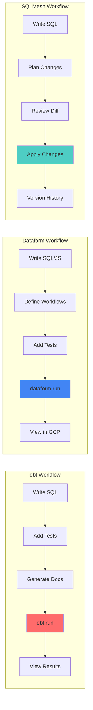

### Code Example Comparison

#### dbt Model
```sql
-- models/marts/customer_metrics.sql
{{ config(materialized='table') }}

with customers as (
    select * from {{ ref('stg_customers') }}
),
orders as (
    select * from {{ ref('stg_orders') }}
)

select
    c.customer_id,
    c.customer_name,
    count(o.order_id) as total_orders,
    sum(o.order_amount) as lifetime_value
from customers c
left join orders o on c.customer_id = o.customer_id
group by 1, 2
```

#### Dataform Action
```javascript
// definitions/customer_metrics.sqlx
config {
  type: "table",
  schema: "marts"
}

select
  c.customer_id,
  c.customer_name,
  count(o.order_id) as total_orders,
  sum(o.order_amount) as lifetime_value
from ${ref("stg_customers")} c
left join ${ref("stg_orders")} o on c.customer_id = o.customer_id
group by 1, 2
```

#### SQLMesh Model
```sql
-- models/customer_metrics.sql
MODEL (
  name marts.customer_metrics,
  kind FULL,
  cron '@daily'
);

SELECT
  c.customer_id,
  c.customer_name,
  COUNT(o.order_id) AS total_orders,
  SUM(o.order_amount) AS lifetime_value
FROM staging.stg_customers c
LEFT JOIN staging.stg_orders o ON c.customer_id = o.customer_id
GROUP BY 1, 2
```

---

## Orchestration Tools Comparison

### When to Use dbt vs Orchestration Tools

| Aspect | dbt | Airflow | Dagster | Prefect |
|--------|-----|---------|---------|---------|
| **Primary Use** | SQL transformations | Workflow orchestration | Data orchestration | Modern orchestration |
| **Language** | SQL | Python | Python | Python |
| **Scheduling** | ✅ Basic | ✅ Advanced | ✅ Advanced | ✅ Advanced |
| **Task Dependencies** | ✅ Model refs | ✅ DAG operators | ✅ Assets | ✅ Tasks |
| **Error Handling** | Basic | ✅ Advanced | ✅ Advanced | ✅ Advanced |
| **Retry Logic** | Basic | ✅ Advanced | ✅ Advanced | ✅ Advanced |
| **Monitoring** | dbt Cloud | ✅ Airflow UI | ✅ Dagster UI | ✅ Prefect UI |
| **Integration** | Works with all | Orchestrates dbt | Orchestrates dbt | Orchestrates dbt |
| **Best For** | SQL transformations | Complex workflows | Data pipelines | Modern Python apps |

### Integration Pattern: dbt + Orchestration

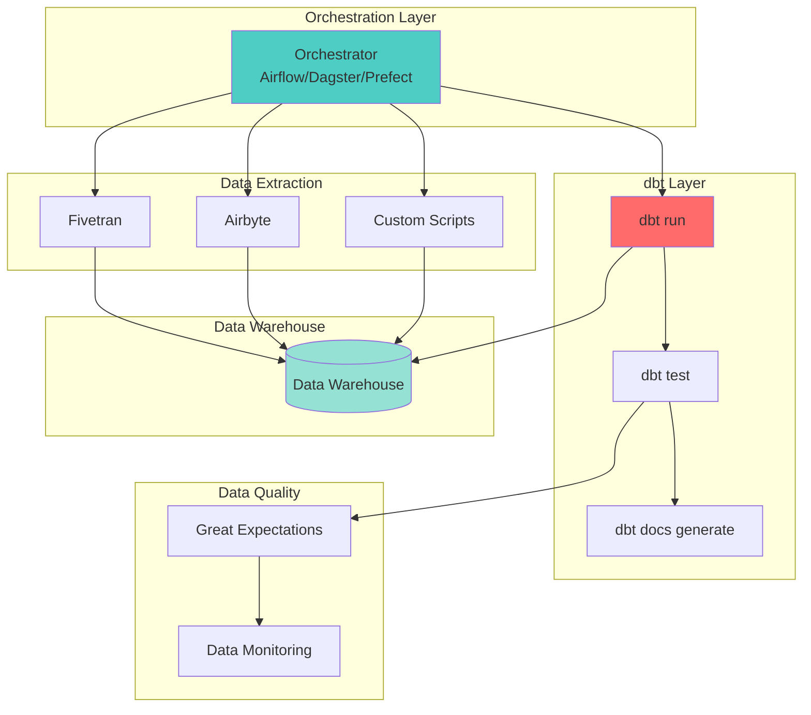

### Airflow + dbt Integration

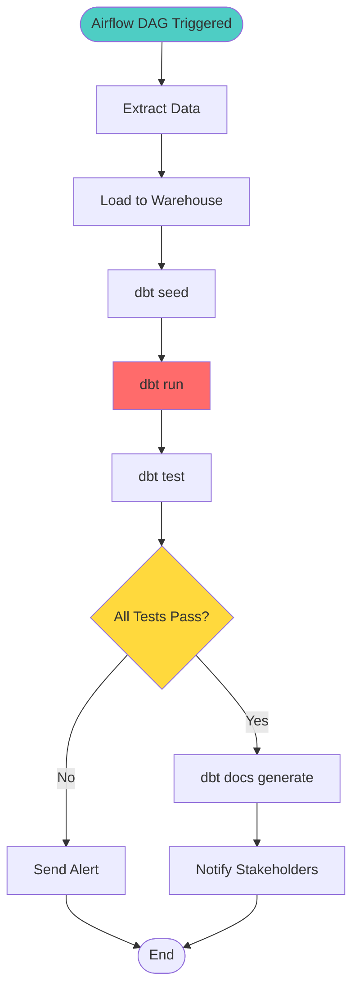

### Dagster + dbt Integration

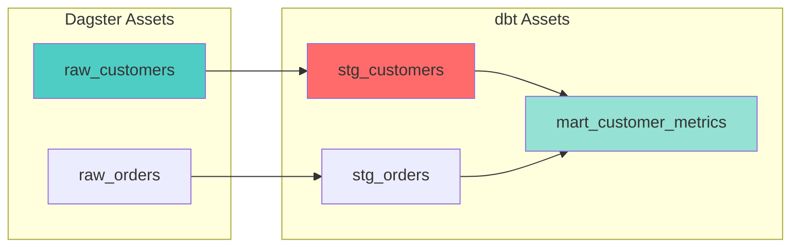

---

## Data Quality Tools Comparison

### dbt Testing vs Data Quality Tools

| Feature | dbt Tests | Great Expectations | Soda | Monte Carlo |
|---------|-----------|-------------------|------|-------------|
| **Integration** | Native in dbt | External library | External service | External service |
| **Test Types** | Generic + Custom SQL | Rich suite | SQL + YAML | ML-based |
| **Data Profiling** | ❌ No | ✅ Yes | ✅ Yes | ✅ Yes |
| **Data Observability** | ❌ No | ⚠️ Limited | ✅ Yes | ✅ Yes |
| **Anomaly Detection** | ❌ No | ❌ No | ⚠️ Basic | ✅ Advanced |
| **Data Lineage** | ✅ Built-in | ⚠️ Limited | ⚠️ Limited | ✅ Yes |
| **Cost** | Free | Free (OSS) | Paid | Paid |
| **Setup Complexity** | Low | Medium | Low | Low |
| **Best For** | dbt users | Python teams | Simple checks | Enterprise |

### Testing Strategy Comparison

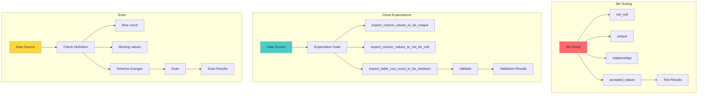

### Combined Approach: dbt + Great Expectations

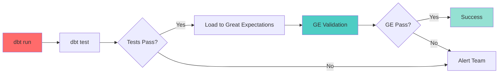

---

## ELT/ETL Tools Comparison

### dbt vs ELT Tools

| Tool | Primary Function | Works With dbt | Use Case |
|------|-----------------|----------------|----------|
| **dbt** | Transform data in warehouse | N/A (is dbt) | SQL transformations |
| **Fivetran** | Extract & Load | ✅ Yes | Automated ELT |
| **Airbyte** | Extract & Load | ✅ Yes | Open-source ELT |
| **Stitch** | Extract & Load | ✅ Yes | Simple ELT |
| **Talend** | ETL Platform | ⚠️ Limited | Enterprise ETL |
| **Informatica** | ETL Platform | ❌ No | Legacy ETL |

### ELT + dbt Architecture

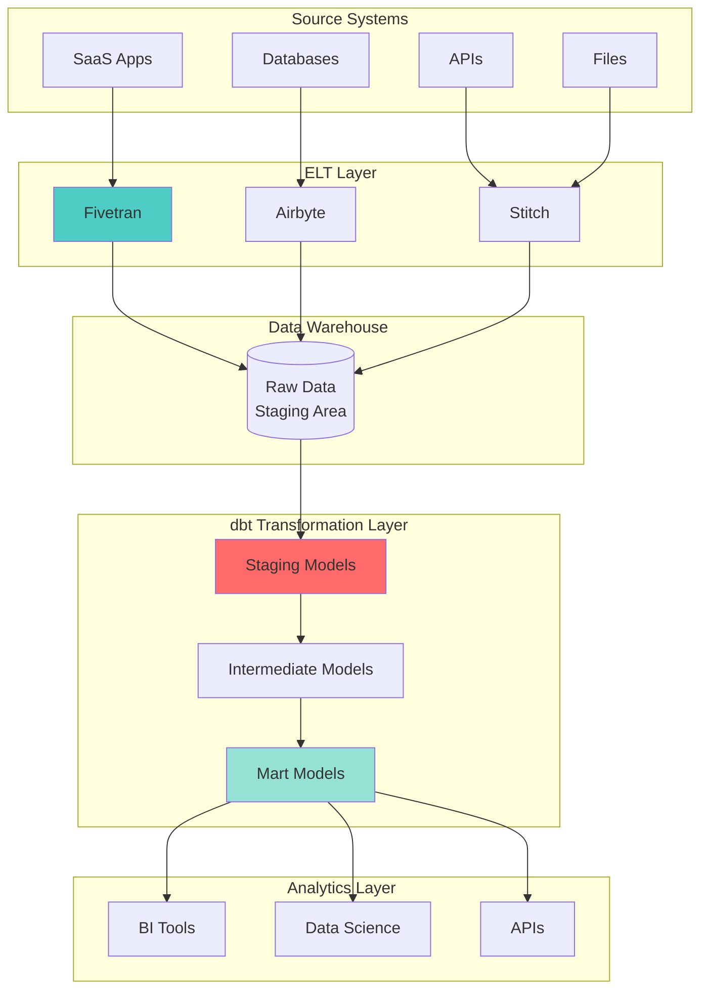

### Data Flow: ELT + dbt

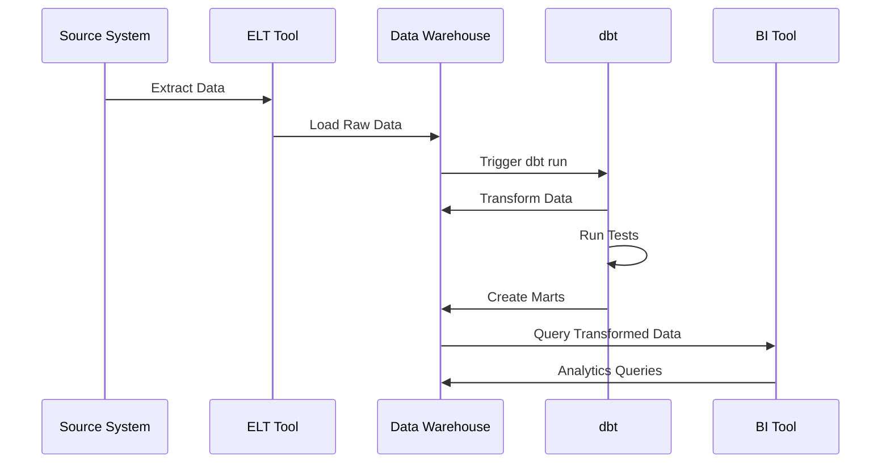

---

## Use Case Scenarios

### Scenario 1: Small Analytics Team

**Requirements:**
- Small team (2-5 people)
- SQL-focused
- Limited budget
- Quick setup needed

**Recommended Stack:**
```
✅ dbt (Open Source)
✅ Git for version control
✅ dbt Cloud (free tier) or self-hosted
✅ Basic testing with dbt tests
```

**Architecture:**
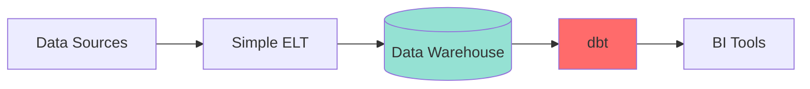

### Scenario 2: Enterprise Data Team

**Requirements:**
- Large team (20+ people)
- Complex workflows
- High reliability needs
- Multiple environments

**Recommended Stack:**
```
✅ dbt (Cloud or Enterprise)
✅ Airflow/Dagster for orchestration
✅ Great Expectations for data quality
✅ Fivetran/Airbyte for ELT
✅ dbt Cloud for CI/CD
```

**Architecture:**
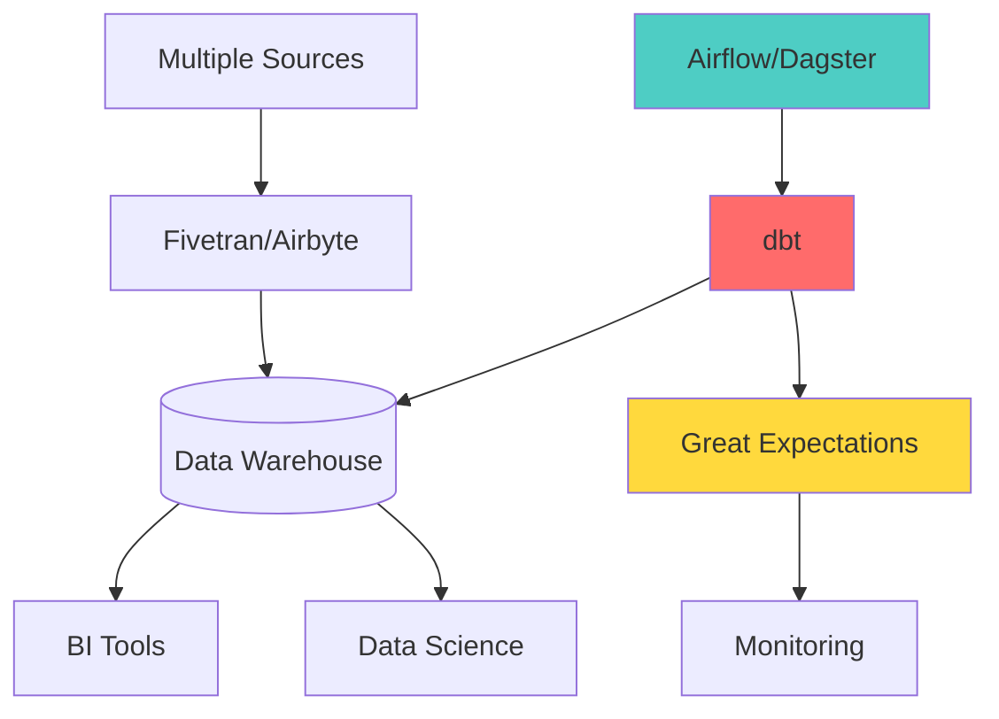

### Scenario 3: Google Cloud Native

**Requirements:**
- Google Cloud infrastructure
- BigQuery as warehouse
- Google ecosystem integration

**Options:**
```
Option A: dbt
✅ Works with BigQuery
✅ Large community
✅ Flexible

Option B: Dataform
✅ Native GCP integration
✅ Built for BigQuery
✅ Google support
```

**Comparison:**
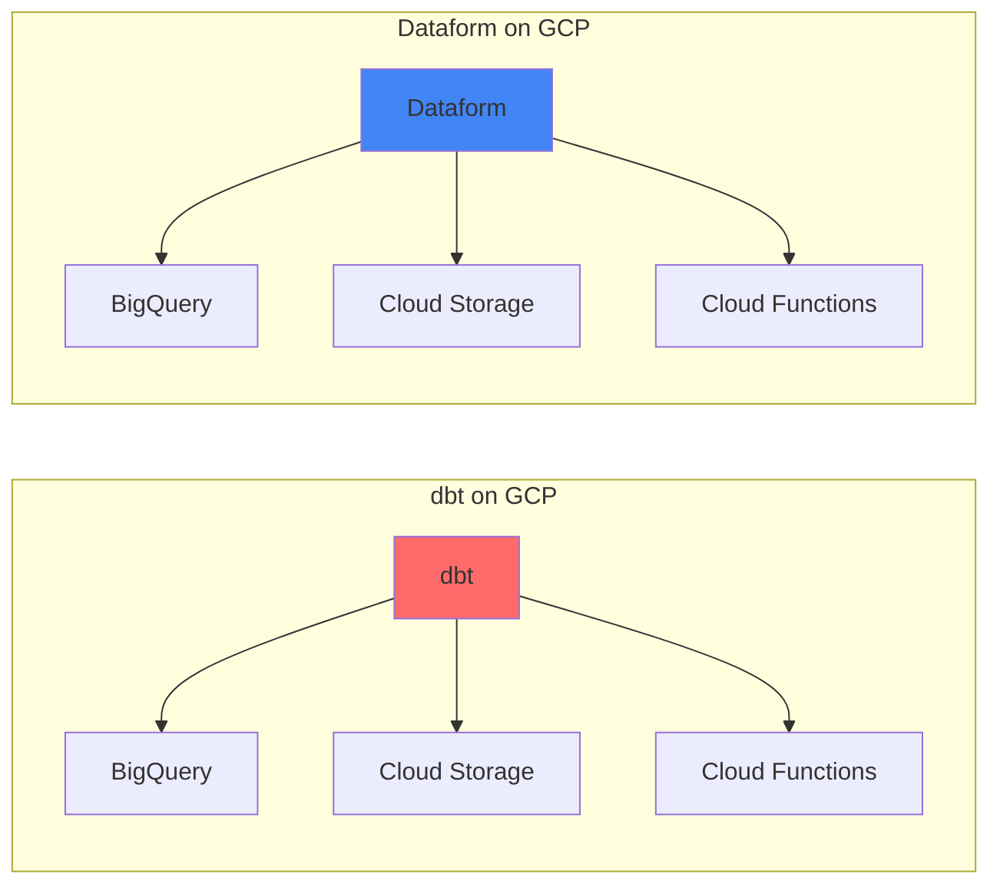

---

## Integration Patterns

### Pattern 1: dbt + Airflow

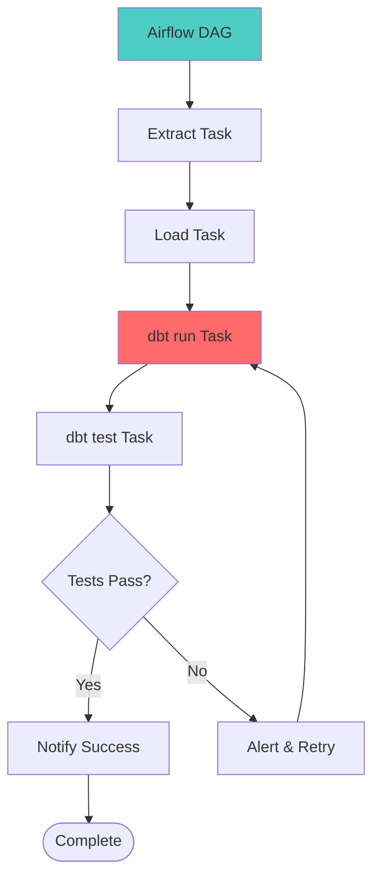

### Pattern 2: dbt + Dagster

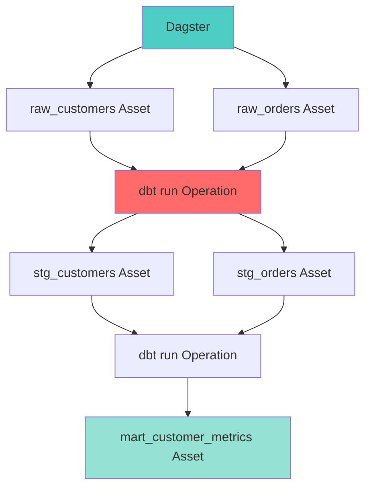

### Pattern 3: dbt + Prefect

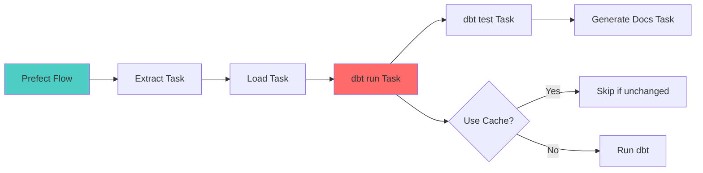

---

## Decision Matrix

### When to Choose dbt

| Scenario | Choose dbt if... |
|----------|------------------|
| **Team Skills** | Team is SQL-focused, not Python-heavy |
| **Use Case** | Need SQL-based transformations in warehouse |
| **Budget** | Want open-source option or flexible pricing |
| **Community** | Need large community and resources |
| **Flexibility** | Want to work with multiple warehouses |
| **Testing** | Need built-in testing framework |
| **Documentation** | Want auto-generated documentation |

### When to Choose Alternatives

| Tool | Choose if... |
|------|--------------|
| **Dataform** | You're all-in on Google Cloud and BigQuery |
| **SQLMesh** | You need advanced data versioning and planning |
| **Airflow** | You need complex workflow orchestration (use WITH dbt) |
| **Dagster** | You want asset-based data orchestration (use WITH dbt) |
| **Prefect** | You prefer modern Python orchestration (use WITH dbt) |
| **Great Expectations** | You need advanced data profiling and validation |
| **Soda** | You want simple data quality checks as a service |

### Feature Priority Matrix

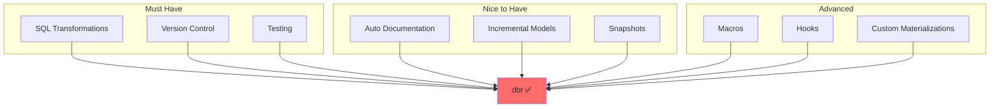

---

## Summary Comparison Table

### Quick Reference

| Tool | Category | Best For | Cost | Learning Curve |
|------|----------|----------|------|----------------|
| **dbt** | Transformation | SQL transformations, Analytics | Free/Paid | Medium |
| **Dataform** | Transformation | Google Cloud users | Paid | Medium |
| **SQLMesh** | Transformation | Advanced versioning | Free | Steep |
| **Airflow** | Orchestration | Complex workflows | Free | Steep |
| **Dagster** | Orchestration | Data pipelines | Free | Medium |
| **Prefect** | Orchestration | Modern Python apps | Free/Paid | Medium |
| **Great Expectations** | Data Quality | Data validation | Free | Medium |
| **Soda** | Data Quality | Simple checks | Paid | Low |
| **Fivetran** | ELT | Automated ELT | Paid | Low |
| **Airbyte** | ELT | Open-source ELT | Free | Medium |

### Final Recommendation

**For most teams:** Start with **dbt** for transformations, add **Airflow/Dagster/Prefect** for orchestration if needed, and integrate **Great Expectations** for advanced data quality.

**For Google Cloud teams:** Consider **Dataform** as an alternative to dbt, but dbt still works great on BigQuery.

**For complex workflows:** Use **dbt** for transformations + **Airflow/Dagster** for orchestration.

---

## Conclusion

dbt excels as a SQL-first transformation tool with excellent testing, documentation, and community support. It works best when:

1. ✅ Your team is SQL-focused
2. ✅ You need transformations in your data warehouse
3. ✅ You want open-source flexibility
4. ✅ You need built-in testing and documentation

dbt is often used **together with** orchestration tools (Airflow, Dagster, Prefect) and data quality tools (Great Expectations, Soda) rather than as a replacement for them.

The modern data stack typically looks like:
```
ELT Tool (Fivetran/Airbyte) → Data Warehouse → dbt → BI Tools
                                    ↓
                        Orchestration (Airflow/Dagster)
                                    ↓
                        Data Quality (Great Expectations)
```


