# dbt: Visual Guide

## Table of Contents
1. [Basic Architecture](#basic-architecture)
2. [Core Components](#core-components)
3. [Data Flow](#data-flow)
4. [Project Structure](#project-structure)
5. [Model Dependencies](#model-dependencies)
6. [Transformation Pipeline](#transformation-pipeline)
7. [Testing Framework](#testing-framework)
8. [Documentation System](#documentation-system)
9. [Advanced Patterns](#advanced-patterns)
10. [Deployment Workflow](#deployment-workflow)

---

## Basic Architecture

### dbt High-Level Architecture

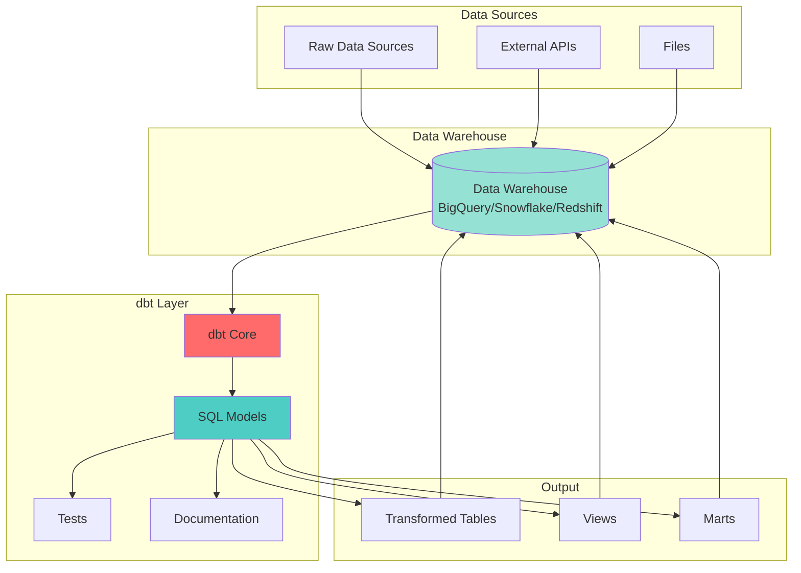

### dbt Core Components

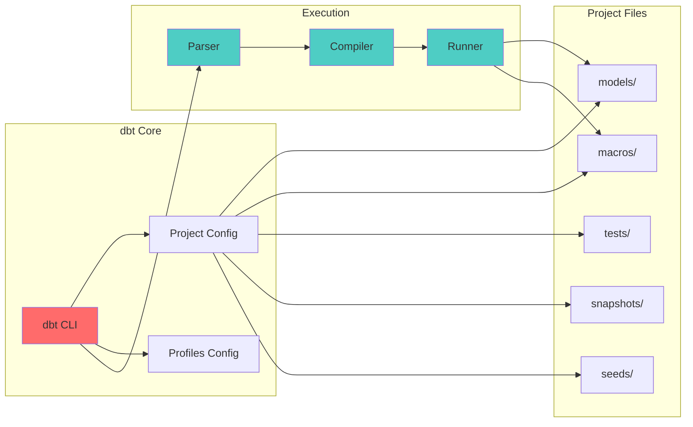

---

## Core Components

### dbt Project Structure

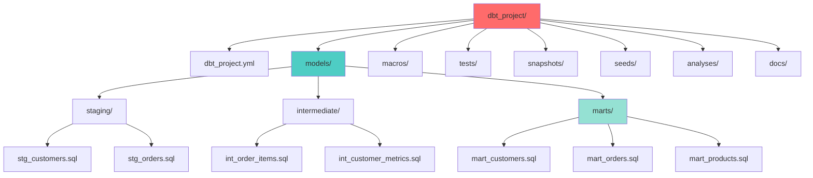

### dbt Configuration Layers

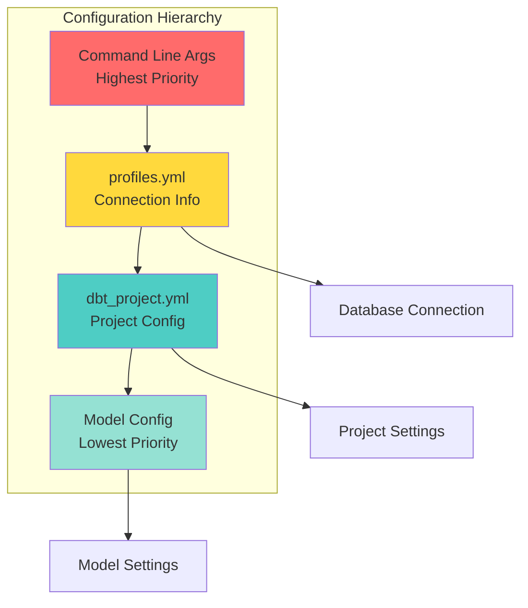

---

## Data Flow

### Basic dbt Transformation Flow

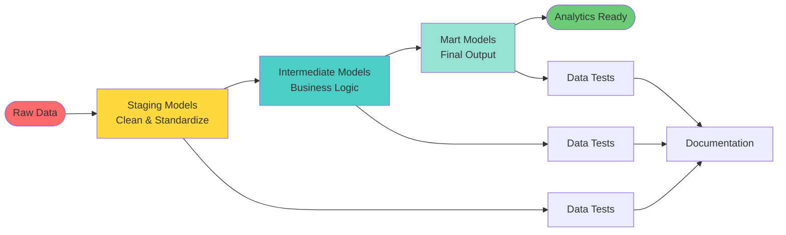

### ELT vs ETL with dbt

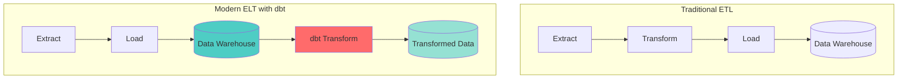

### Data Lineage Flow

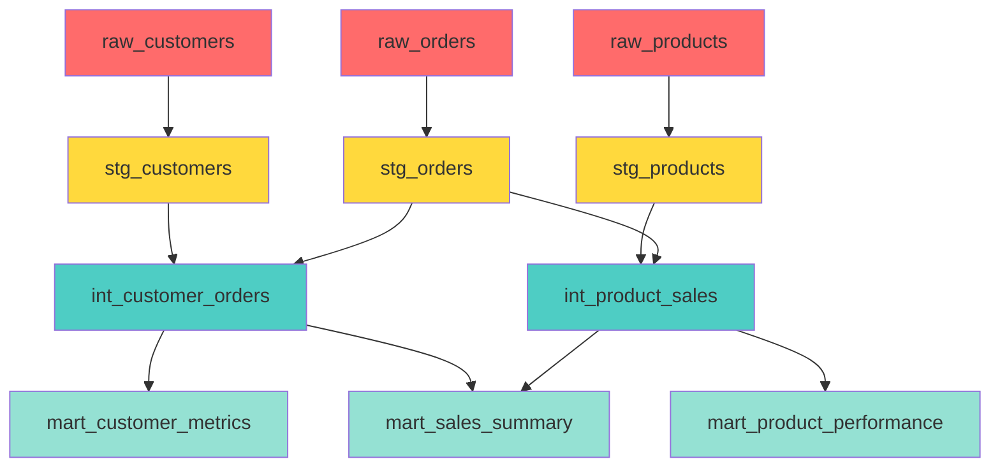

---

## Project Structure

### dbt Project Organization

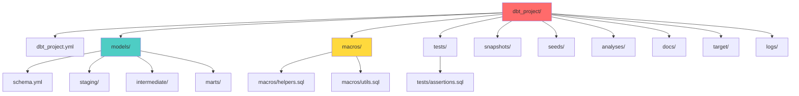

### Model Layers Architecture

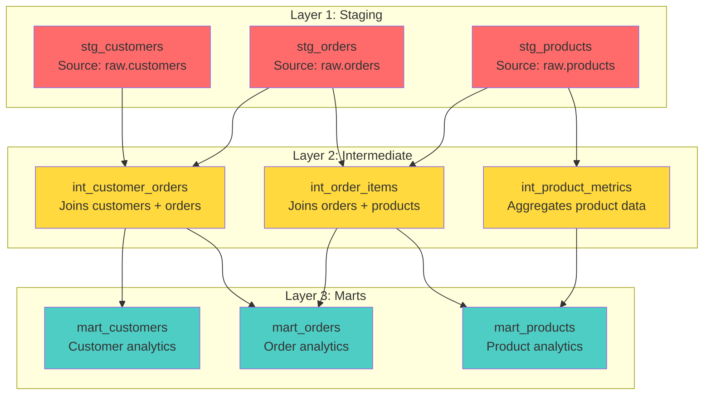

---

## Model Dependencies

### Dependency Graph

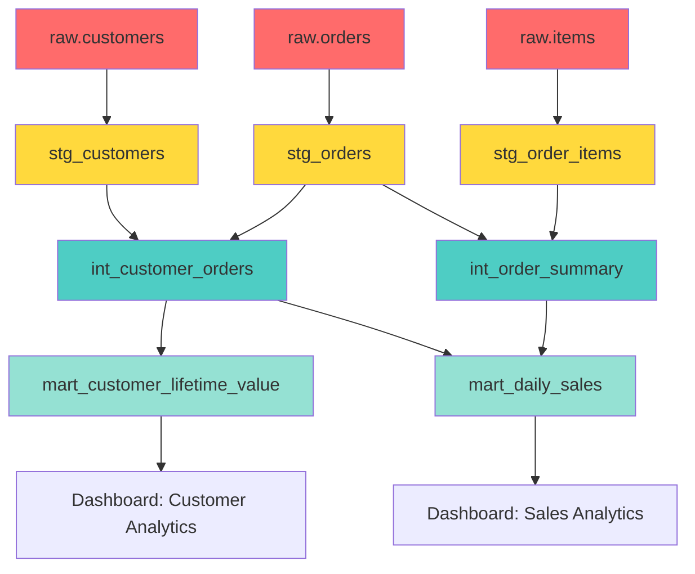

### Model Selection and Dependencies

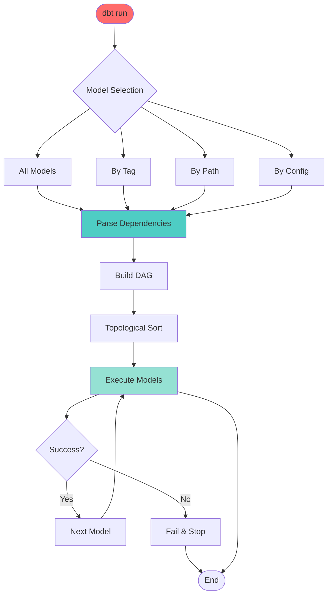

---

## Transformation Pipeline

### Complete Transformation Pipeline

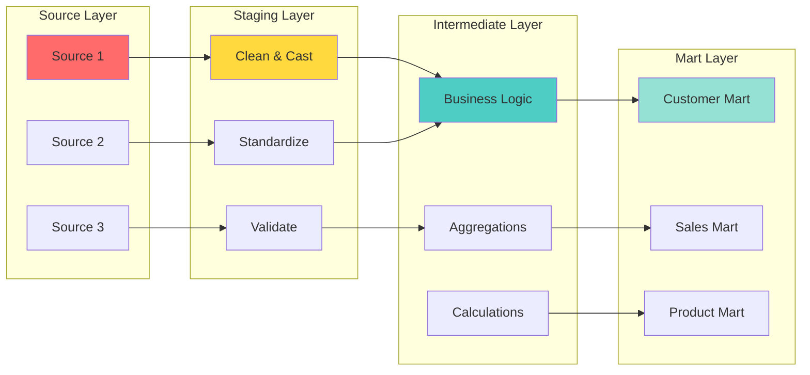

### Incremental Model Strategy

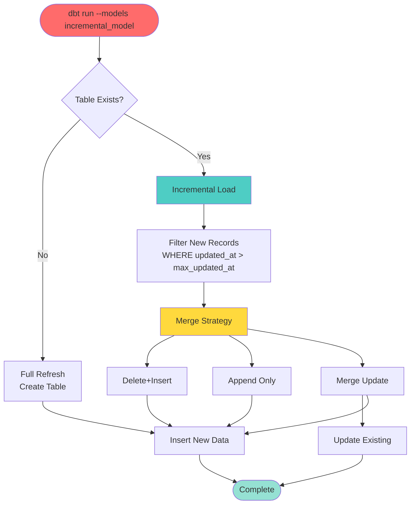

---

## Testing Framework

### dbt Testing Architecture

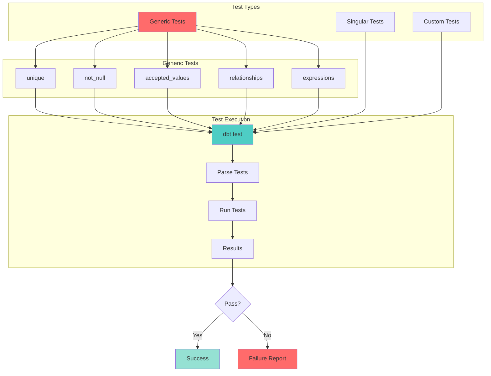

### Test Coverage Strategy

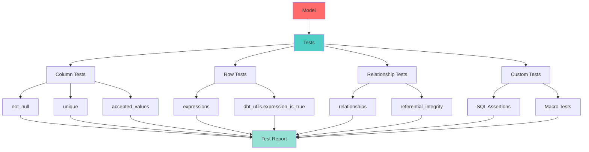

---

## Documentation System

### dbt Documentation Flow

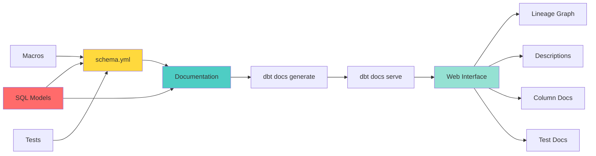

### Documentation Structure

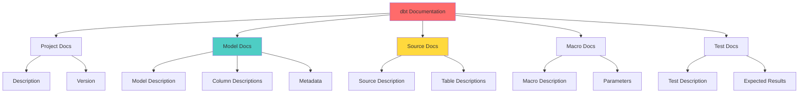

---

## Advanced Patterns

### Snapshot Strategy

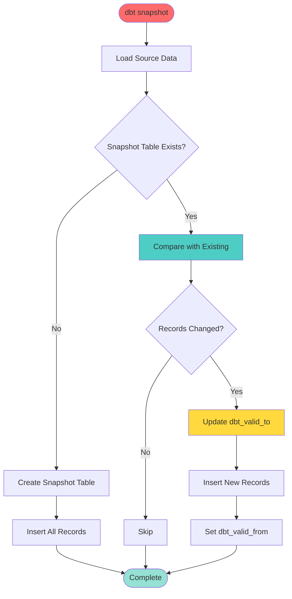

### Materialization Strategies

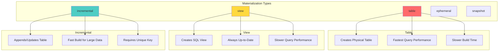

### Macro Usage Pattern

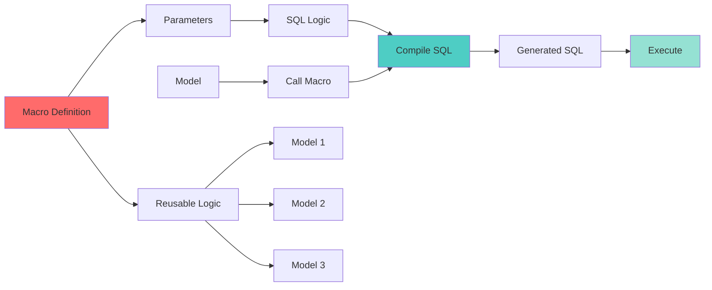

### Hook Execution Flow

```mermaid
flowchart TD
    START([dbt Command]) --> PRE_HOOK[Pre-Hooks]
    
    PRE_HOOK --> ON_RUN_START[on-run-start]
    ON_RUN_START --> RUN[Run Models]
    
    RUN --> MODEL1[Model 1]
    RUN --> MODEL2[Model 2]
    RUN --> MODEL3[Model 3]
    
    MODEL1 --> POST_HOOK1[Post-Hook 1]
    MODEL2 --> POST_HOOK2[Post-Hook 2]
    MODEL3 --> POST_HOOK3[Post-Hook 3]
    
    POST_HOOK1 --> ON_RUN_END[on-run-end]
    POST_HOOK2 --> ON_RUN_END
    POST_HOOK3 --> ON_RUN_END
    
    ON_RUN_END --> END([Complete])
    
    style START fill:#FF6B6B
    style PRE_HOOK fill:#FFD93D
    style RUN fill:#4ECDC4
    style ON_RUN_END fill:#95E1D3
```

---

## Deployment Workflow

### CI/CD Pipeline with dbt

```mermaid
flowchart LR
    DEV[Development] --> COMMIT[Git Commit]
    COMMIT --> CI[CI Pipeline]
    
    CI --> LINT[dbt parse]
    CI --> TEST[dbt test]
    CI --> BUILD[dbt build]
    
    LINT --> LINT_RESULT{Lint Pass?}
    TEST --> TEST_RESULT{Tests Pass?}
    BUILD --> BUILD_RESULT{Build Success?}
    
    LINT_RESULT -->|No| FAIL1[Fail CI]
    TEST_RESULT -->|No| FAIL2[Fail CI]
    BUILD_RESULT -->|No| FAIL3[Fail CI]
    
    LINT_RESULT -->|Yes| MERGE
    TEST_RESULT -->|Yes| MERGE
    BUILD_RESULT -->|Yes| MERGE
    
    MERGE[Merge to Main] --> PROD[Production]
    PROD --> DEPLOY[dbt run --target prod]
    DEPLOY --> MONITOR[Monitor]
    
    style DEV fill:#FF6B6B
    style CI fill:#FFD93D
    style PROD fill:#4ECDC4
    style MONITOR fill:#95E1D3
```

### Environment Strategy

```mermaid
graph TB
    subgraph "Environments"
        DEV[Development]
        STAGING[Staging]
        PROD[Production]
    end
    
    subgraph "Development"
        DEV_PROF[dev profile]
        DEV_SCHEMA[dev schema]
        DEV_TARGET[dev target]
    end
    
    subgraph "Staging"
        STAGE_PROF[staging profile]
        STAGE_SCHEMA[staging schema]
        STAGE_TARGET[staging target]
    end
    
    subgraph "Production"
        PROD_PROF[prod profile]
        PROD_SCHEMA[prod schema]
        PROD_TARGET[prod target]
    end
    
    DEV --> DEV_PROF
    DEV --> DEV_SCHEMA
    DEV --> DEV_TARGET
    
    STAGING --> STAGE_PROF
    STAGING --> STAGE_SCHEMA
    STAGING --> STAGE_TARGET
    
    PROD --> PROD_PROF
    PROD --> PROD_SCHEMA
    PROD --> PROD_TARGET
    
    style DEV fill:#FF6B6B
    style STAGING fill:#FFD93D
    style PROD fill:#4ECDC4
```

### dbt Cloud Workflow

```mermaid
flowchart TD
    TRIGGER[Trigger] --> QUEUE[Queue Job]
    
    TRIGGER --> SCHEDULE[Scheduled]
    TRIGGER --> MANUAL[Manual]
    TRIGGER --> API[API Call]
    TRIGGER --> WEBHOOK[Webhook]
    
    QUEUE --> EXECUTE[Execute Job]
    
    EXECUTE --> STEP1[Install dbt]
    STEP1 --> STEP2[Install Dependencies]
    STEP2 --> STEP3[Run dbt Commands]
    
    STEP3 --> RUN[dbt run]
    STEP3 --> TEST[dbt test]
    STEP3 --> DOCS[dbt docs generate]
    
    RUN --> RESULT[Results]
    TEST --> RESULT
    DOCS --> RESULT
    
    RESULT --> NOTIFY[Notifications]
    NOTIFY --> EMAIL[Email]
    NOTIFY --> SLACK[Slack]
    NOTIFY --> WEB[Web UI]
    
    style TRIGGER fill:#FF6B6B
    style EXECUTE fill:#4ECDC4
    style RESULT fill:#95E1D3
```

---

## Summary

This visual guide covers dbt from basic concepts to advanced patterns:

1. **Basic Architecture**: Understanding how dbt fits into the data stack
2. **Core Components**: Project structure and configuration
3. **Data Flow**: How data moves through transformations
4. **Model Dependencies**: Understanding the DAG and execution order
5. **Transformation Pipeline**: Staging → Intermediate → Marts pattern
6. **Testing Framework**: Comprehensive testing strategies
7. **Documentation System**: Auto-generated documentation
8. **Advanced Patterns**: Snapshots, macros, hooks, and materializations
9. **Deployment Workflow**: CI/CD and environment management

Each diagram illustrates key concepts and relationships in dbt, helping you understand both the fundamentals and advanced usage patterns.
