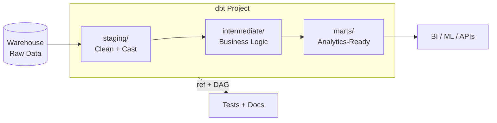

# dbt — Cheatsheet

## Architecture (30-second mental model)

## When to use vs alternatives
| Need | Use | Not |
|------|-----|-----|
| SQL-first transformations inside the warehouse | dbt | Spark/Airflow (overkill for pure SQL) |
| BigQuery-native with zero setup on GCP | Dataform | dbt (requires separate hosting or dbt Cloud) |
| Complex multi-language pipelines (Python + SQL + Spark) | Dagster / Airflow | dbt alone (it only does the T in ELT) |
| Advanced change-planning with virtual environments | SQLMesh | dbt (no built-in plan/apply diff) |
| Data extraction and loading | Fivetran / Airbyte | dbt (it transforms, not extracts) |

## 5 things you always forget
1. `{{ this }}` in incremental models refers to the **target** table, not the source -- and on first run it does not exist, so wrap lookups in ``.
2. `dbt run` does NOT execute tests; you need `dbt build` (run + test + snapshot + seed) or an explicit `dbt test` step in CI.
3. Ephemeral models compile as CTEs into downstream queries -- if 5 models ref the same ephemeral, the CTE is duplicated 5 times, silently bloating query cost.
4. `--full-refresh` on an incremental model drops and recreates the table -- in production this can break downstream dashboards during the rebuild window if you have no blue/green swap.
5. `sources` defined in `schema.yml` have a `loaded_at_field` + `freshness` block, but freshness checks only run with `dbt source freshness`, not during `dbt run` or `dbt test`.

## Interview killer answer
> "We structured our dbt project into staging, intermediate, and mart layers with strict ref-based lineage so the DAG enforced build order. The real win was incremental models with merge strategies on high-volume event tables -- it cut our daily build from 45 minutes to under 4 because we only processed new partitions. We paired dbt tests in CI with `dbt source freshness` alerts in production, so schema drift or late-arriving data triggered Slack notifications before analysts even noticed. The part most people underestimate is the macro system -- we wrote a generic `surrogate_key` macro and a cross-database timestamp cast that saved us weeks when we migrated from Redshift to Snowflake."
