# Tech Stack Comprehensive Guide

## Table of Contents

- [DevOps](#devops)
  - [Docker](#docker)
  - [Kubernetes](#kubernetes)
  - [Terraform](#terraform)
  - [GitHub Actions](#github-actions)
  - [Jenkins](#jenkins)
  - [Monitoring](#monitoring)
- [Data Engineering](#data-engineering)
  - [Apache Spark](#apache-spark)
  - [Python](#python)
  - [Scala](#scala)
  - [Java](#java)
  - [SQL](#sql)
  - [Airflow](#airflow)
  - [Kafka](#kafka)
- [GCP (Google Cloud Platform)](#gcp-google-cloud-platform)
  - [BigQuery](#bigquery)
  - [Cloud Storage](#cloud-storage)
  - [Vertex AI](#vertex-ai)
  - [Cloud Run](#cloud-run)
  - [Cloud Functions](#cloud-functions)
  - [Dataflow](#dataflow)
- [AI-ML](#ai-ml)
  - [scikit-learn](#scikit-learn)
  - [TensorFlow](#tensorflow)
  - [PyTorch](#pytorch)
  - [MLflow](#mlflow)
  - [Weights & Biases](#weights--biases)
- [Gen-AI](#gen-ai)
  - [OpenAI GPT](#openai-gpt)
  - [LangChain](#langchain)
  - [Vector Databases](#vector-databases)
  - [Embeddings](#embeddings)
  - [RAG](#rag)
- [Frontend](#frontend)
  - [React](#react)
  - [TypeScript](#typescript)
  - [Streamlit](#streamlit)
  - [Material-UI](#material-ui)
  - [D3.js](#d3js)
- [Backend](#backend)
  - [FastAPI](#fastapi)
  - [Node.js](#nodejs)
  - [Python](#python-backend)
  - [Redis](#redis)
  - [SQLite](#sqlite)
- [Databases](#databases)
  - [PostgreSQL](#postgresql)
  - [MongoDB](#mongodb)
  - [Neo4j](#neo4j)
  - [Elasticsearch](#elasticsearch)
  - [Redis](#redis-databases)
- [Tools](#tools)
  - [VS Code](#vs-code)
  - [Jupyter](#jupyter)
  - [Git](#git)
  - [Pandas](#pandas)
  - [NumPy](#numpy)
  - [Matplotlib](#matplotlib)
  - [Seaborn](#seaborn)
  - [Plotly](#plotly)

## Data Engineering

### Python

Python is a versatile, high-level programming language emphasizing readability and simplicity. Its syntax uses indentation to define code blocks, with # for comments. Built-in data types include integers (int), floats, strings (str), booleans, lists, tuples, dictionaries (dict), and sets. Control structures feature if-elif-else conditionals, for and while loops with break/continue. Functions are defined with the def keyword, supporting parameters and returns. Code is organized into modules via import statements. Object-oriented programming uses the class keyword for classes, objects, inheritance, and polymorphism. Key libraries for data science and AI include NumPy for numerical arrays, Pandas for data manipulation, Matplotlib/Seaborn for visualization, Scikit-learn for machine learning algorithms, and TensorFlow/PyTorch for deep learning models.

```mermaid
graph TD
    A[Python Programming] --> B[Core Syntax]
    A --> C[Data Types]
    A --> D[Control Structures]
    A --> E[Functions]
    A --> F[Modules]
    A --> G[Object-Oriented Programming]
    A --> H[Libraries Ecosystem]

    B --> B1[Indentation-based blocks]
    B --> B2[Comments with #]
    B --> B3[Expressions and operators]

    C --> C1[int, float, str, bool]
    C --> C2[list, tuple, dict, set]

    D --> D1[if-elif-else]
    D --> D2[for/while loops]
    D --> D3[break/continue]

    E --> E1[def keyword]
    E --> E2[Parameters and return]

    F --> F1[import statements]
    F --> F2[Standard library]

    G --> G1[class keyword]
    G --> G2[Inheritance]
    G --> G3[Polymorphism]

    H --> I[Data Science Libraries]
    H --> J[AI/ML Libraries]

    I --> I1[NumPy - Numerical computing]
    I --> I2[Pandas - Data manipulation]
    I --> I3[Matplotlib - Visualization]
    I --> I4[Seaborn - Statistical plots]
    I --> I5[SciPy - Scientific computing]

    J --> J1[Scikit-learn - ML algorithms]
    J --> J2[TensorFlow - Deep learning]
    J --> J3[PyTorch - Neural networks]
    J --> J4[Keras - High-level DL API]
    J --> J5[spaCy - NLP]

    I --> K[Workflow: Data Processing]
    J --> L[Workflow: Model Training]
    K --> M[Applications]
    L --> M
```



### Java

**JVM (Java Virtual Machine)**: The JVM is the runtime environment that executes Java bytecode, enabling platform-independent execution ("write once, run anywhere") through interpretation or JIT compilation for performance.

**Syntax**: Java uses a C/C++-style syntax with curly braces for blocks, semicolons to end statements, and keywords like class, public, and void; it emphasizes object-oriented structure with classes and methods.

**OOP Principles**: Core principles include encapsulation (hiding data within classes), inheritance (subclassing for code reuse), polymorphism (method overriding for flexibility), and abstraction (interfaces and abstract classes for generalization).

**Collections**: The Collections Framework provides interfaces and classes (e.g., List, Set, Map) for storing and manipulating groups of objects, supporting operations like sorting, searching, and iteration.

**Concurrency**: Java supports multithreading with classes like Thread and Executor, enabling parallel execution; features include synchronization (via synchronized blocks), locks, and atomic operations for thread-safe code.

**Frameworks**: Popular frameworks include Spring (for enterprise applications and dependency injection), Hibernate (for ORM and database mapping), and Jakarta EE (formerly Java EE, for web and enterprise services).

```mermaid
mindmap
  root((Java Programming))
    JVM
      Bytecode Execution
        Platform Independent
        JIT Compilation
        Garbage Collection
      HotSpot VM
        Performance Optimization
    Syntax
      C/C++-like Structure
        Curly Braces {}
        Semicolons ;
        Keywords (class, public, void)
      Object-Oriented Focus
        Classes and Methods
    OOP Principles
      Encapsulation
        Data Hiding
      Inheritance
        Subclassing
      Polymorphism
        Method Overriding
      Abstraction
        Interfaces/Abstract Classes
    Collections Framework
      Interfaces
        List (ArrayList, LinkedList)
        Set (HashSet, TreeSet)
        Map (HashMap, TreeMap)
      Operations
        Sorting, Searching, Iteration
    Concurrency
      Multithreading
        Thread Class
        Executor Framework
      Synchronization
        synchronized Blocks
        Locks and Atomic Variables
    Frameworks
      Spring
        Dependency Injection
        Web Applications
      Hibernate
        ORM Mapping
        Database Integration
      Jakarta EE
        Enterprise Services
        Web Components
    Ecosystem
      JVM Languages
        Kotlin
        Scala
        Groovy
        Clojure
      Build Tools
        Maven
        Gradle
      IDEs
        IntelliJ IDEA
        Eclipse
        VS Code
      Libraries
        Apache Commons
        Guava
      Platforms
        Java SE (Standard)
        Java EE (Enterprise)
        Java ME (Micro)
```
